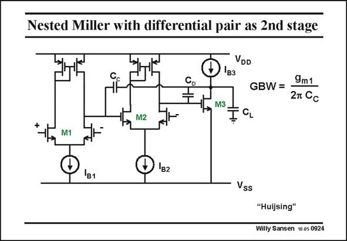

# SANSEN-0924 · Nested Miller with differential pair as 2nd stage

章节：09 多级运算放大器设计  
PDF 页：268；书本页：275；幻灯片编号：0924  
状态：unreviewed



## 对应教材讲解

### PDF 268 · 书本 275

In this original realization, a differential pair is used as a second stage. Only MOSTs are now used, rather than bipolar transistors. The two compensation capacitances are easily found. As this circuit originates from a bipolar version of Huijsing, it is denoted by ‘‘Huijsing’’.

## 公式／性能结论候选摘录

以下为规则截取的原文，尚未逐项判读。

（未由规则找到；不代表原页没有此类内容。）

## 曲线结论候选摘录

以下为规则截取的原文，尚未逐项判读。

（未由规则找到；不代表原页没有此类内容。）

## 原文条件与近似候选摘录

以下为规则截取的原文，尚未逐项判读。

（未由规则找到；不代表原页没有此类内容。）

## 幻灯片 OCR（未校正）

```text
Nested Miller with differential pair as 2nd stage
VDD
'вз
+
GBW =
9m1
27 Cc
-, M3
+
M2
M1
Iв2
Vss
"Huijsing"
Willy Sansen 10 a5 0924
```

数学上下标、分数及正负号以原图为准。电路图已保留；未核对的连接不输出成可仿真 netlist。
