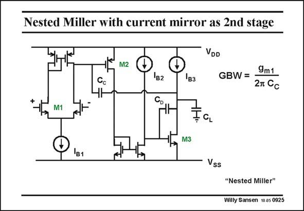

# SANSEN-0925 · Nested Miller with current mirror as 2nd stage

章节：09 多级运算放大器设计  
PDF 页：268；书本页：275；幻灯片编号：0925  
状态：unreviewed



## 对应教材讲解

### PDF 268 · 书本 275

The only difference between the previous amplifier and this one is the use of a current mirror as a second stage. The input and output stage are the same. Also the load capacitance and the currents are the same. The only question is therefore, which one of these amplifiers can achieve a higher GBW. This will obviously depend on the nondominant poles associated with the second stage. This amplifier is denoted by a ‘‘nested Miller’’ although both of them are nested Miller amplifiers.

## 公式／性能结论候选摘录

以下为规则截取的原文，尚未逐项判读。

- PDF 268: The only question is therefore, which one of these amplifiers can achieve a higher GBW.
- PDF 268: This will obviously depend on the nondominant poles associated with the second stage.

## 曲线结论候选摘录

以下为规则截取的原文，尚未逐项判读。

（未由规则找到；不代表原页没有此类内容。）

## 原文条件与近似候选摘录

以下为规则截取的原文，尚未逐项判读。

（未由规则找到；不代表原页没有此类内容。）

## 幻灯片 OCR（未校正）

```text
Nested Miller with current mirror as 2nd stage
VDD
M2
'B2
Cc
M1I
Івз
M3
GBW =
9m1
27 Cc
Ia
Vss
"Nested Miller"
Willy Sansen 10 as 0925
```

数学上下标、分数及正负号以原图为准。电路图已保留；未核对的连接不输出成可仿真 netlist。
