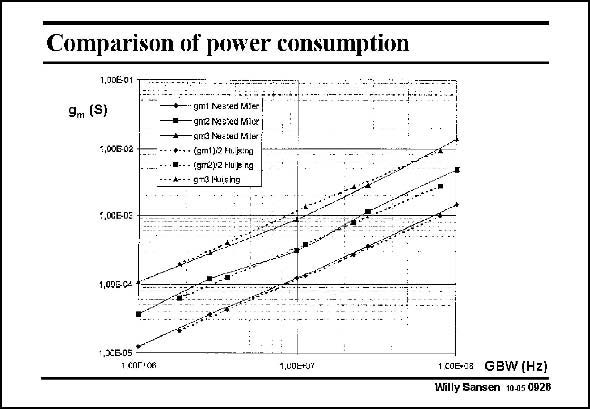

# SANSEN-0926 · Comparison of power consumption 1,00€-01

章节：09 多级运算放大器设计  
PDF 页：269；书本页：276；幻灯片编号：0926  
状态：unreviewed



## 对应教材讲解

### PDF 269 · 书本 276

Both amplifiers have been designed for the same load capacitance. They are designed for different values of the GBW, using a Butterworth 3rd order response. Afterwards they are optimized somewhat by means of a few additional simulations. The curves give the values of the transconductances of the three stages. The currents are proportional to them, depending on the chosen values of VGS-VT. These curves show that there is only a minor difference between both amplifiers. The main difference is found at higher frequencies. For values of the GBW around 100 MHz, the opamp with a differential pair as a second stage has more difficulty in reaching this 100 MHz than the one with a current mirror. This shows that the latter approach is more advantageous for higher frequencies.

## 公式／性能结论候选摘录

以下为规则截取的原文，尚未逐项判读。

- PDF 269: The currents are proportional to them, depending on the chosen values of VGS-VT.

## 曲线结论候选摘录

以下为规则截取的原文，尚未逐项判读。

- PDF 269: The curves give the values of the transconductances of the three stages.
- PDF 269: These curves show that there is only a minor difference between both amplifiers.

## 原文条件与近似候选摘录

以下为规则截取的原文，尚未逐项判读。

（未由规则找到；不代表原页没有此类内容。）

## 幻灯片 OCR（未校正）

```text
Comparison of power consumption
1,00€-01
9m (S)
1,00G-02
• gmt Nesred P.AJer
gnk Nadied tilex
- gird Nueted Mier
•0.-- (sm1):2 Mi. jxino
w..- (gm2)2 Hupng
• A- • 9m3 |uchg
5.00E-03
1,00B. C4
1 6Or•06
1,00LFJr
1 C0E-03 GBW (Hz)
Willy Sansen 10.05 092B
```

数学上下标、分数及正负号以原图为准。电路图已保留；未核对的连接不输出成可仿真 netlist。
