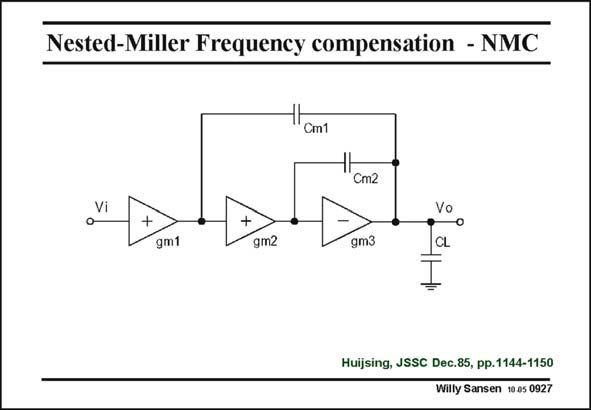

# SANSEN-0927 · Nested-Miller Frequency compensation - NMC

章节：09 多级运算放大器设计  
PDF 页：269；书本页：276；幻灯片编号：0927  
状态：unreviewed



## 对应教材讲解

### PDF 269 · 书本 276

Now several more NMC opamps will be discussed. For sake of comparison, the conventional three-stage NMC amplifier is repeated. Its main disadvantage is the current consumption of the output stage. Indeed, compensation capacitance C shunts the output stage. m2 Its gain is now reduced at higher frequencies. Therefore, transconductance g must be enlarged m3 to ensure pole splitting. The design procedure is repeated next.

## 公式／性能结论候选摘录

以下为规则截取的原文，尚未逐项判读。

- PDF 269: Indeed, compensation capacitance C shunts the output stage. m2 Its gain is now reduced at higher frequencies.
- PDF 269: Therefore, transconductance g must be enlarged m3 to ensure pole splitting.

## 曲线结论候选摘录

以下为规则截取的原文，尚未逐项判读。

（未由规则找到；不代表原页没有此类内容。）

## 原文条件与近似候选摘录

以下为规则截取的原文，尚未逐项判读。

（未由规则找到；不代表原页没有此类内容。）

## 幻灯片 OCR（未校正）

```text
Nested-Miller Frequency compensation - NMC
Cm1
ЧН
Cm2
Vi
+
gm1
gm2
gm3
Vo
CL
Huijsing, JSSC Dec.85, pp.1144-1150
Willy Sansen 10 a5 0927
```

数学上下标、分数及正负号以原图为准。电路图已保留；未核对的连接不输出成可仿真 netlist。
