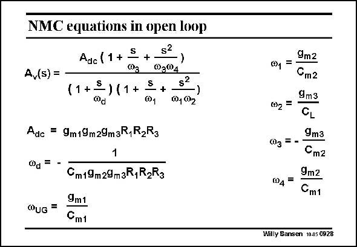

# SANSEN-0928 · NMC equations in open loop

章节：09 多级运算放大器设计  
PDF 页：270；书本页：277；幻灯片编号：0928  
状态：unreviewed



## 对应教材讲解

### PDF 270 · 书本 277

In an open loop, three poles occur and two zeros. They are given on the right. The open-loop gain A is dc large because three stages are present. The resistance of each node I to ground is denoted by R . i The capacitance of each node to ground is small. Actually, the minimum the compensation capacitances are taken to be at least three times larger than those parasitic node capacitances. This is why the node capacitances do not show up in the approximate expressions in this slide. The dominant pole is caused by the Miller effect of the overall compensation capacitance C . m1 The GBW is determined by this capacitance C and the input transconductance. m1 The design procedure is given next.

## 公式／性能结论候选摘录

以下为规则截取的原文，尚未逐项判读。

- PDF 270: The open-loop gain A is dc large because three stages are present.

## 曲线结论候选摘录

以下为规则截取的原文，尚未逐项判读。

（未由规则找到；不代表原页没有此类内容。）

## 原文条件与近似候选摘录

以下为规则截取的原文，尚未逐项判读。

- PDF 270: This is why the node capacitances do not show up in the approximate expressions in this slide.

## 幻灯片 OCR（未校正）

```text
NMC equations in open loop
$2
Adc (1 +
+
A,(s) =
03®4
11+3
-1 +
s?
+
@1
)
0, 02
Adc = 9m19m29m3R,R2R3
0d =
Cm19m29m3R,R2Rg
QUG =
9m1
Cm1
9m2
@1 =
°m2
9m3
CL
9m3
0g =-
Cm2
9mz
Cm1
Willy Sansen 10.05 0928
```

数学上下标、分数及正负号以原图为准。电路图已保留；未核对的连接不输出成可仿真 netlist。
