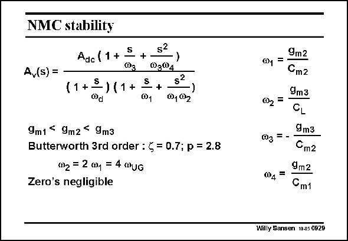

# SANSEN-0929 · NMC stability

章节：09 多级运算放大器设计  
PDF 页：270；书本页：277；幻灯片编号：0929  
状态：unreviewed



## 对应教材讲解

### PDF 270 · 书本 277

We can normally assume that the transconductances increase towards the output. For a 3rd-order Butterworth response, the two non-dominant poles v and v have 1 2 to be put at 2 and 4 times the GBW. Both zeros are usually negligible. Note that one of them is in the right half of the complex plane. Note that we still have to solve a system of three equations (for the GBW, v and 1 v ) and five variables. 2 Normally, the two compensation capacitances are chosen. The first one C can be chosen as m1 small as possible, i.e. at least three times the node capacitance at the output of the first stage but not so small that the input noise is too high. The other capacitance C can also be chosen as small as possible, i.e. at least three times the m2 node capacitance at the output of the second stage. Minimum values of these compensation capacitances are always chosen to reduce the power

### PDF 271 · 书本 278

consumption as much as possible. Of course, if noise is an important specification, then these capacitances may have to be increased, increasing the power consumption. As expected, low noise always leads to larger power consumption. Designers often take C and C to be the same and give them a low value. This is clearly m1 m2 never an optimum design!

## 公式／性能结论候选摘录

以下为规则截取的原文，尚未逐项判读。

- PDF 270: We can normally assume that the transconductances increase towards the output.
- PDF 271: Of course, if noise is an important specification, then these capacitances may have to be increased, increasing the power consumption.

## 曲线结论候选摘录

以下为规则截取的原文，尚未逐项判读。

（未由规则找到；不代表原页没有此类内容。）

## 原文条件与近似候选摘录

以下为规则截取的原文，尚未逐项判读。

- PDF 270: We can normally assume that the transconductances increase towards the output.

## 幻灯片 OCR（未校正）

```text
NMC stability
S
Adc (1 +
A,(s) =
(1+S
-) (1+
+
$2
03®4
+
@1
s?
001 02
)
9m1 < 9m2- 9m3
Butterworth 3rd order : § = 0.7; p = 2.8
(2 = 2 mp = 4 mUG
Zero's negligible
9m2
01 =
Cm2
9m3
002 =
CL
9m3
03 = -
Cm2
9m2
04
=
Cm1
Willy Sansen 10.05 0929
```

数学上下标、分数及正负号以原图为准。电路图已保留；未核对的连接不输出成可仿真 netlist。
