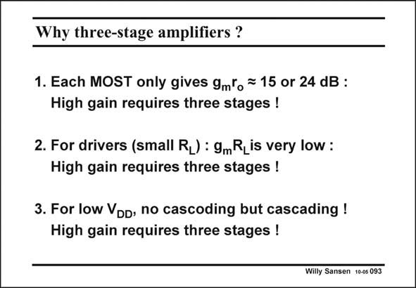

# SANSEN-093 · Why three-stage amplifiers ?

章节：09 多级运算放大器设计  
PDF 页：257；书本页：264；幻灯片编号：093  
状态：unreviewed



## 对应教材讲解

### PDF 257 · 书本 264

The main reason for more than two stages is gain. Despite the availability of gain boosting, bootstrapping, etc. to increase the gain, quite often the supply voltage is just too low. In this case, three stages or more may be required. For small channel lengths, the gain per transistor, which is g r , has become m o quite small. For example, for 130 nm CMOS, less than about 15 (or 24 dB) per transistor can be expected. For large gains, three or more stages are therefore required. This is certainly true if a small resistor or large capacitance must be driven. In this case, the output stage provides little gain. Two more stages are then required to drive the output stage with a lot of gain. For very low supply voltages less than 1 V, cascoding is no longer possible because of the reduced output swings. Cascading is then required, as shown next.

## 公式／性能结论候选摘录

以下为规则截取的原文，尚未逐项判读。

- PDF 257: The main reason for more than two stages is gain.
- PDF 257: Despite the availability of gain boosting, bootstrapping, etc. to increase the gain, quite often the supply voltage is just too low.
- PDF 257: For small channel lengths, the gain per transistor, which is g r , has become m o quite small.
- PDF 257: For large gains, three or more stages are therefore required.
- PDF 257: In this case, the output stage provides little gain.
- PDF 257: Two more stages are then required to drive the output stage with a lot of gain.

## 曲线结论候选摘录

以下为规则截取的原文，尚未逐项判读。

（未由规则找到；不代表原页没有此类内容。）

## 原文条件与近似候选摘录

以下为规则截取的原文，尚未逐项判读。

（未由规则找到；不代表原页没有此类内容。）

## 幻灯片 OCR（未校正）

```text
Why three-stage amplifiers ?
1. Each MOST only gives 9mlo = 15 or 24 dB :
High gain requires three stages !
2. For drivers (small R_) : 9mR, is very low :
High gain requires three stages !
3. For low Vod, no cascoding but cascading !
High gain requires three stages !
Willy Sansen 10-05 093
```

数学上下标、分数及正负号以原图为准。电路图已保留；未核对的连接不输出成可仿真 netlist。
