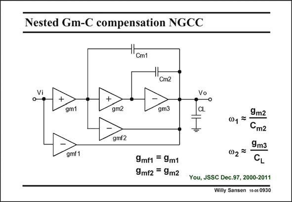

# SANSEN-0930 · Nested Gm-C compensation NGCC

章节：09 多级运算放大器设计  
PDF 页：271；书本页：278；幻灯片编号：0930  
状态：unreviewed



## 对应教材讲解

### PDF 271 · 书本 278

This three-stage configuration has nested Miller compensation with additional Gm blocks for realizing two feedforward paths. If their transconductances are chosen to be the same as their corresponding stage transconductances then both zeros’ are cancelled out. The two resulting nondominant poles are then the same as for a conventional NMC amplifier. Little is gained in terms of power consumption.

## 公式／性能结论候选摘录

以下为规则截取的原文，尚未逐项判读。

（未由规则找到；不代表原页没有此类内容。）

## 曲线结论候选摘录

以下为规则截取的原文，尚未逐项判读。

（未由规则找到；不代表原页没有此类内容。）

## 原文条件与近似候选摘录

以下为规则截取的原文，尚未逐项判读。

（未由规则找到；不代表原页没有此类内容。）

## 幻灯片 OCR（未校正）

```text
Nested Gm-C compensation NGCC
Cm2
+
gm1
+
gm2
gm3
Vo
CL
gmf2
gmf 1
9mf1 = 9m1
9mf2 = 9m2
9m2
01=-
Cm2
9m3
02=
CL
You, JSSC Dec.97, 2000-2011
Willy Sansen 10-0s 0930
```

数学上下标、分数及正负号以原图为准。电路图已保留；未核对的连接不输出成可仿真 netlist。
