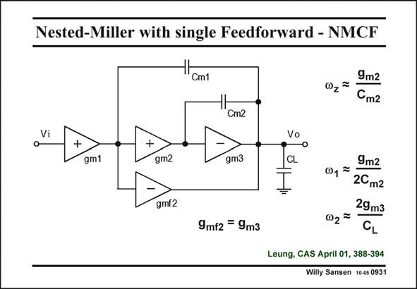

# SANSEN-0931 · Nested-Miller with single Feedforward - NMCF

章节：09 多级运算放大器设计  
PDF 页：271；书本页：278；幻灯片编号：0931  
状态：unreviewed



## 对应教材讲解

### PDF 271 · 书本 278

One single feedforward path can be used as well. Its transconductance g howmf2 ever, equals the transconductance g of the output m3 stage. It is used to generate a zero v in the left half of z the complex plane, to cancel out a non-dominant pole. It therefore increases the phase margin. If g >g , then the nonm3 m2 dominant poles can be approximated as shown in this slide. On the other hand, the power consumption is also increased, as the feedforward stage and the output stage take the largest currents.

## 公式／性能结论候选摘录

以下为规则截取的原文，尚未逐项判读。

- PDF 271: Its transconductance g howmf2 ever, equals the transconductance g of the output m3 stage.
- PDF 271: It therefore increases the phase margin.
- PDF 271: On the other hand, the power consumption is also increased, as the feedforward stage and the output stage take the largest currents.

## 曲线结论候选摘录

以下为规则截取的原文，尚未逐项判读。

- PDF 271: It therefore increases the phase margin.

## 原文条件与近似候选摘录

以下为规则截取的原文，尚未逐项判读。

- PDF 271: If g >g , then the nonm3 m2 dominant poles can be approximated as shown in this slide.

## 幻灯片 OCR（未校正）

```text
Nested-Miller with single Feedforward - NMCF
1Cm1
0, = 9m2
Cm2
Cm2
Vi
+
+
gm1
gm2
gm3
gmf2
9mf2 = 9m3
CL
9m2
2Cm2
29m3
CL
Leung, CAS April 01, 388-394
Willy Sansen 10-05 0931
```

数学上下标、分数及正负号以原图为准。电路图已保留；未核对的连接不输出成可仿真 netlist。
