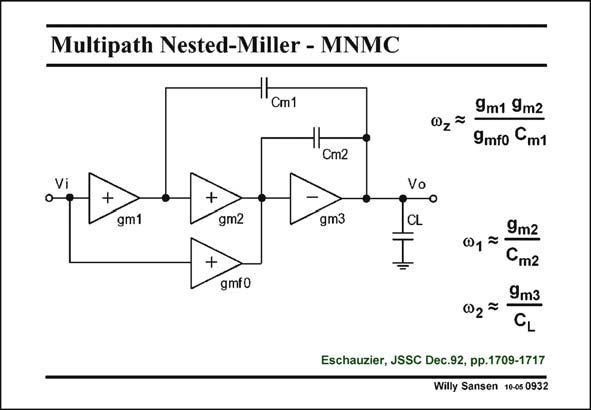

# SANSEN-0932 · Multipath Nested-Miller - MNMC

章节：09 多级运算放大器设计  
PDF 页：272；书本页：279；幻灯片编号：0932  
状态：unreviewed



## 对应教材讲解

### PDF 272 · 书本 279

Another compensation technique is the multi-path nested Miller, shown in this slide. The feedforward stage now bridges the input and the second stage. It is not connected to the output. This feedforward stage is used to generate a zero v z in the left half of the complex plane, to cancel out a non-dominant pole. It therefore increases the phase margin. If g >g , then the nonm3 m2 dominant poles can be approximated as shown in this slide. They are the same as for a conventional NMC amplifier.

## 公式／性能结论候选摘录

以下为规则截取的原文，尚未逐项判读。

- PDF 272: It therefore increases the phase margin.

## 曲线结论候选摘录

以下为规则截取的原文，尚未逐项判读。

- PDF 272: It therefore increases the phase margin.

## 原文条件与近似候选摘录

以下为规则截取的原文，尚未逐项判读。

- PDF 272: If g >g , then the nonm3 m2 dominant poles can be approximated as shown in this slide.

## 幻灯片 OCR（未校正）

```text
Multipath Nested-Miller - MNMC
1cmt
c0z = 9m1 mz
9mfo Cm1
"Cm2
Vi
+
gm1
+
+
gm2
gmfO
gm3
CL
9mг
Cm2
9m3
027
CL
Eschauzier, JSSC Dec.92, pp.1709-1717
Willy Sansen 1005 0932
```

数学上下标、分数及正负号以原图为准。电路图已保留；未核对的连接不输出成可仿真 netlist。
