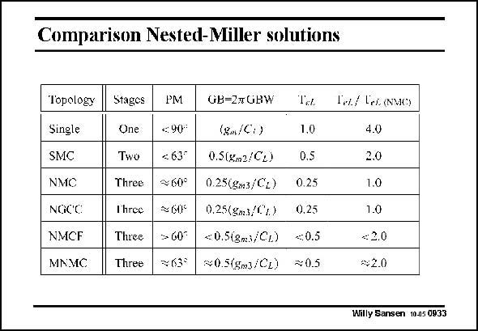

# SANSEN-0933 · Comparison Nested-Miller solutions

章节：09 多级运算放大器设计  
PDF 页：272；书本页：279；幻灯片编号：0933  
状态：unreviewed



## 对应教材讲解

### PDF 272 · 书本 279

For sake of comparison all previous amplifiers are listed in a table. They are preceded by a single-stage and a two-stage Miller amplifier. All of them have a comparable phase margin except for the single-stage amplifier. The resulting GBW for a 3rd-order Butterworth design is also listed as a fraction of the output time constant g /C . m3 L The next column shows what GBW can be expected, compared to a single-stage amplifier. The conventional NMC amplifier only achieves about 1/4 of what a single stage can achieve. When compared to a NMC amplifier (in the last column), it is clear that both last amplifiers which use a single feedforward stage do better in terms of power consumption. However, the improvement is at best a factor of 2. This is why we will now concentrate on three-stage amplifiers, which provide much better current savings.

## 公式／性能结论候选摘录

以下为规则截取的原文，尚未逐项判读。

（未由规则找到；不代表原页没有此类内容。）

## 曲线结论候选摘录

以下为规则截取的原文，尚未逐项判读。

- PDF 272: All of them have a comparable phase margin except for the single-stage amplifier.

## 原文条件与近似候选摘录

以下为规则截取的原文，尚未逐项判读。

（未由规则找到；不代表原页没有此类内容。）

## 幻灯片 OCR（未校正）

```text
Comparison Nested-Miller solutions
Topology
Single
SMC
NMC
NOCC
NMCF
MNMC
Stagcs
One
Two
Three
I'hree
Three
Three
PM
€:90
c 63°
$60°
$605
7033
GB=2 GBW
Ta.
(gn/C:)
1.0
0.5 (Xm2/C2)
0.5
0.25(gm3/C2) 0.25
0,25(gms/C7.) 0.25
<: 0.5(gms/CL)
s:0.5
x0.5(5m3/CL)
#0.5
Ie/ Lei (NMC)
4.0
2.0
1.0
1.0
€:2.0
s2.0
Willy Sansen 10-05 0933
```

数学上下标、分数及正负号以原图为准。电路图已保留；未核对的连接不输出成可仿真 netlist。
