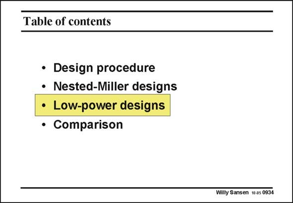

# SANSEN-0934 · Table of contents

章节：09 多级运算放大器设计  
PDF 页：273；书本页：280；幻灯片编号：0934  
状态：unreviewed



## 对应教材讲解

### PDF 273 · 书本 280

For really low power consumption, other configurations must be found. They will all try to generate extra zeros in the left half of the complex plane, in order to cancel one of the non-dominant poles, without however, taking too much extra power consumption. Three configurations will be discussed. The last two achieve considerable savings in power consumption, beyond that which can be achieved with a single stage.

## 公式／性能结论候选摘录

以下为规则截取的原文，尚未逐项判读。

（未由规则找到；不代表原页没有此类内容。）

## 曲线结论候选摘录

以下为规则截取的原文，尚未逐项判读。

（未由规则找到；不代表原页没有此类内容。）

## 原文条件与近似候选摘录

以下为规则截取的原文，尚未逐项判读。

（未由规则找到；不代表原页没有此类内容。）

## 幻灯片 OCR（未校正）

```text
Table of contents
• Design procedure
• Nested-Miller designs
• Low-power designs
• Comparison
Willy Sansen 10.as 0934
```

数学上下标、分数及正负号以原图为准。电路图已保留；未核对的连接不输出成可仿真 netlist。
