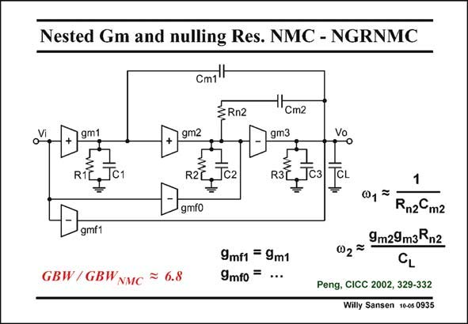

# SANSEN-0935 · Nested Gm and nulling Res. NMC - NGRNMC

章节：09 多级运算放大器设计  
PDF 页：273；书本页：280；幻灯片编号：0935  
状态：unreviewed



## 对应教材讲解

### PDF 273 · 书本 280

The first configuration is close to the NGCC shown previously. It also uses two feedforward stages. The only difference with the NGCC amplifier is the nulling resistor R in series with n2 the second compensation capacitance. This is a well known technique of generating a zero in the left-halfplane, at least when this resistor R is made larger n2 than 1/g (see Chapter 4). m3 Again, the feedforward stages are used to cancel out the zero’s. This time, however, transconductance g is made larger in order to generate leftmf0 hand zeros. As a result, the complex non-dominant poles are made to cancel with a pair of complex left-hand zero’s. For a 3rd-order Butterworth realization, this gives a GBW which is 6.8 times larger than a NMC realization with the same load capacitance and power consumption.

## 公式／性能结论候选摘录

以下为规则截取的原文，尚未逐项判读。

- PDF 273: As a result, the complex non-dominant poles are made to cancel with a pair of complex left-hand zero’s.

## 曲线结论候选摘录

以下为规则截取的原文，尚未逐项判读。

（未由规则找到；不代表原页没有此类内容。）

## 原文条件与近似候选摘录

以下为规则截取的原文，尚未逐项判读。

（未由规则找到；不代表原页没有此类内容。）

## 幻灯片 OCR（未校正）

```text
Nested Gm and nulling Res. NMC - NGRNMC
Cm1l
3 Rn2
gm1
R1L
.Jс1
gm2
R2L
Jc2
gmfo
Cm2
gm3
R3L
gmf1
GBW/GBWNMC = 6.8
9mf1 = 9m1
9mfo = ...
CL
1
01 7
Rnz m2
9m29m3Rn2
002=
Peng, CICC 2002, 329-332
Willy Sansen 10-05 0935
```

数学上下标、分数及正负号以原图为准。电路图已保留；未核对的连接不输出成可仿真 netlist。
