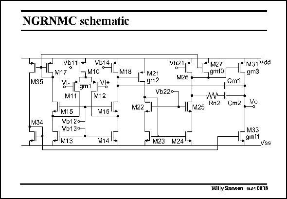

# SANSEN-0936 · NGRNMC schematic

章节：09 多级运算放大器设计  
PDF 页：274；书本页：281；幻灯片编号：0936  
状态：unreviewed



## 对应教材讲解

### PDF 274 · 书本 281

A circuit realization of the NGRNMC amplifier is shown in this slide. The input stage is a folded cascode. Current mirrors are used as noninverting amplifiers. Current mirror M27/M17 is used to set accurately the value of g . Also, current mf0 mirror M33/M34 is used to set g . mf1 This latter feedforward stage is also used for better large-signal performance. It increases the Slew Rate of the output stage drastically. The output stage is now biased as a class-AB stage. The quiescent current is set accurately by transistor M34. However, he maximum output currents are a lot larger. The Slew Rate will now be limited by the DC current of the first stage into compensation capacitance C . m1

## 公式／性能结论候选摘录

以下为规则截取的原文，尚未逐项判读。

- PDF 274: It increases the Slew Rate of the output stage drastically.
- PDF 274: The Slew Rate will now be limited by the DC current of the first stage into compensation capacitance C . m1

## 曲线结论候选摘录

以下为规则截取的原文，尚未逐项判读。

（未由规则找到；不代表原页没有此类内容。）

## 原文条件与近似候选摘录

以下为规则截取的原文，尚未逐项判读。

（未由规则找到；不代表原页没有此类内容。）

## 幻灯片 OCR（未校正）

```text
NGRNMC schematic
M35
M34
7M10 °
VilLgm|Vit
M11
M12
"M1S"
MIGn
Vb120-
Vb130-
M1s • M14l
1* M21
- gm2
Vb21 *
L* M27
M26 •
79mro
/C M31 Vda
gm3
CmT
Vb22o-
M22
I[M25 Rn2
Cm2
Vº
-M23 м24
M33
1.gmf1
Vss
Willy Sansen 1005 093B
```

数学上下标、分数及正负号以原图为准。电路图已保留；未核对的连接不输出成可仿真 netlist。
