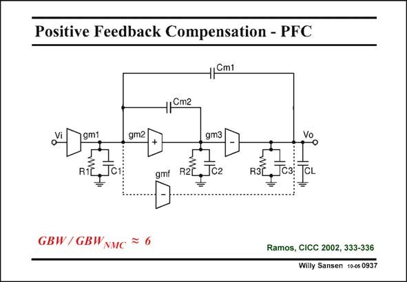

# SANSEN-0937 · Positive Feedback Compensation - PFC

章节：09 多级运算放大器设计  
PDF 页：274；书本页：281；幻灯片编号：0937  
状态：unreviewed



## 对应教材讲解

### PDF 274 · 书本 281

A second low-power nested Miller compensation technique uses positive feedback with capacitance C m2 around the second-stage. Its purpose is again to introduce a left-hand zero in order to cancel out one of the nondominant poles. A single feedforward stage is used to turn the output stage into a class-AB stage. In this way the Slew Rate will be limited by the DC current in the first stage.

## 公式／性能结论候选摘录

以下为规则截取的原文，尚未逐项判读。

- PDF 274: In this way the Slew Rate will be limited by the DC current in the first stage.

## 曲线结论候选摘录

以下为规则截取的原文，尚未逐项判读。

（未由规则找到；不代表原页没有此类内容。）

## 原文条件与近似候选摘录

以下为规则截取的原文，尚未逐项判读。

（未由规则找到；不代表原页没有此类内容。）

## 幻灯片 OCR（未校正）

```text
Positive Feedback Compensation - PFC
4|Cml
1Cm2
gm1
RIL
gm2
gmi
gm3|
Jсг
R3L
сз:
Vo
CL
GBW/GBWvMC
Ramos, CICC 2002, 333-336
Wiily Sansen 1-0s 0937
```

数学上下标、分数及正负号以原图为准。电路图已保留；未核对的连接不输出成可仿真 netlist。
