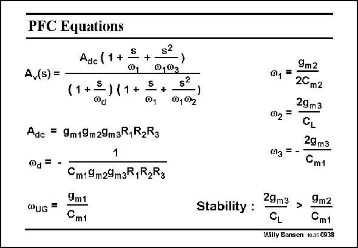

# SANSEN-0938 · PFC Equations

章节：09 多级运算放大器设计  
PDF 页：275；书本页：282；幻灯片编号：0938  
状态：unreviewed



## 对应教材讲解

### PDF 275 · 书本 282

The approximate expression of the open-loop gain is given in this slide. As expected, three poles show up and two zero’s. The GBW is the same as for any three-stage amplifier with an overall Miller capacitance C . m1 Note, however, that the first non-dominant pole coincides with the first zero. They now cancel each other. For stability, transconductance g must be m3 sufficiently large or compensation capacitance C . m1 Relatively large values are used for C to avoid excessive power consumption. m1 For a 3rd-order Butterworth realization, this PFC configuration gives a GBW which is about 6 times larger than a NMC realization with the same load capacitance and power consumption.

## 公式／性能结论候选摘录

以下为规则截取的原文，尚未逐项判读。

- PDF 275: The approximate expression of the open-loop gain is given in this slide.

## 曲线结论候选摘录

以下为规则截取的原文，尚未逐项判读。

（未由规则找到；不代表原页没有此类内容。）

## 原文条件与近似候选摘录

以下为规则截取的原文，尚未逐项判读。

- PDF 275: The approximate expression of the open-loop gain is given in this slide.

## 幻灯片 OCR（未校正）

```text
PFC Equations
S
Adc (1 +
Q1
+
A,(s) =
11+3
-11+
S
@1
Adc = 9m19m29m3R,R2R3
0d =
$2
+
s?
001 02
)
9m2
0, =
20m2
29m3
002 =
CL
29m3
(03 = -
Cm1
QUG
Cm19m29m3R,R2R3
9m1
Cm1
Stability :
29m3
>
9m2
CL
Cm1
Willy Sansen 10.05 0938
```

数学上下标、分数及正负号以原图为准。电路图已保留；未核对的连接不输出成可仿真 netlist。
