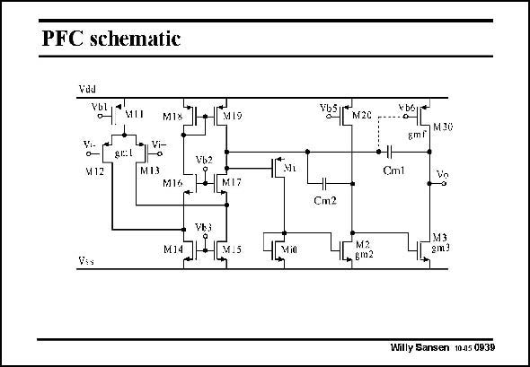

# SANSEN-0939 · PFC schematic

章节：09 多级运算放大器设计  
PDF 页：275；书本页：282；幻灯片编号：0939  
状态：unreviewed



## 对应教材讲解

### PDF 275 · 书本 282

A circuit realization is shown in this slide. Again, a folded cascode is used at the input. A current mirror is used as a second stage. The compensation capacitances are easily identified. The Gate of output transistor is connected to the output of the first stage, turning the output stage into a class-AB amplifier. This greatly improves the Slew Rate as it is now limited by the total DC current in the input stage into compensation capacitance C . m1

## 公式／性能结论候选摘录

以下为规则截取的原文，尚未逐项判读。

- PDF 275: This greatly improves the Slew Rate as it is now limited by the total DC current in the input stage into compensation capacitance C . m1

## 曲线结论候选摘录

以下为规则截取的原文，尚未逐项判读。

（未由规则找到；不代表原页没有此类内容。）

## 原文条件与近似候选摘录

以下为规则截取的原文，尚未逐项判读。

（未由规则找到；不代表原页没有此类内容。）

## 幻灯片 OCR（未校正）

```text
PFC schematic
VdJ
MIo
VgetV
M12
MI3
Vb2
|M17
- Vg
M.S
is
NUỆI M2C -
amr]MIc
Cm1
Cm2
M2
-gm2
M3
gm3
Willy Sansen 10.05 0939
```

数学上下标、分数及正负号以原图为准。电路图已保留；未核对的连接不输出成可仿真 netlist。
