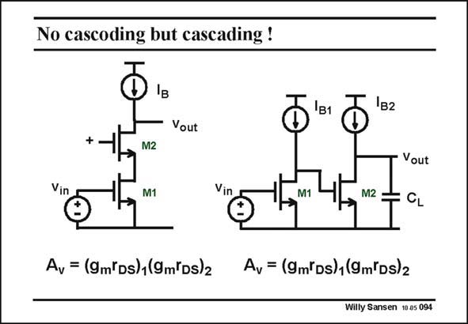

# SANSEN-094 · No cascoding but cascading !

章节：09 多级运算放大器设计  
PDF 页：257；书本页：264；幻灯片编号：094  
状态：unreviewed



## 对应教材讲解

### PDF 257 · 书本 264

Both a cascode stage and a cascaded stage provide the same gain because both circuits have the same number of transistors in the signal path. However, the latter one takes more current. Only current sources are used here as ideal loads. Despite the larger current, the cascade stage can provide a rail-to-rail output swing, which may be very desirable for low supply voltages. The speed is not higher however, as shown next.

## 公式／性能结论候选摘录

以下为规则截取的原文，尚未逐项判读。

- PDF 257: Both a cascode stage and a cascaded stage provide the same gain because both circuits have the same number of transistors in the signal path.

## 曲线结论候选摘录

以下为规则截取的原文，尚未逐项判读。

（未由规则找到；不代表原页没有此类内容。）

## 原文条件与近似候选摘录

以下为规则截取的原文，尚未逐项判读。

（未由规则找到；不代表原页没有此类内容。）

## 幻灯片 OCR（未校正）

```text
No cascoding but cascading !
Vout
+.
M2
Vin
M1
Vin
M1
Vout
M2:
÷ CL
Ay = (9m'Ds)1(9m(Ds)2
Ay = (9m'Ds),(9m'Ds)2
Willy Sansen 10as 094
```

数学上下标、分数及正负号以原图为准。电路图已保留；未核对的连接不输出成可仿真 netlist。
