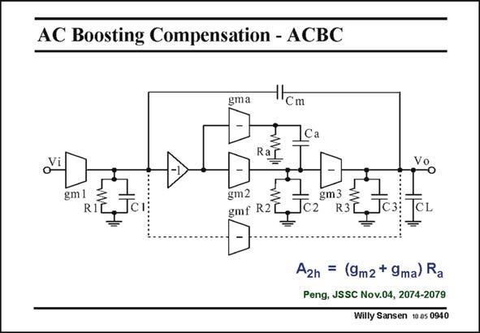

# SANSEN-0940 · AC Boosting Compensation - ACBC

章节：09 多级运算放大器设计  
PDF 页：276；书本页：283；幻灯片编号：0940  
状态：unreviewed



## 对应教材讲解

### PDF 276 · 书本 283

Another low-power threestage amplifier is shown in this slide. Again the second compensation capacitance C is taken away from m2 shunting the output stage. It is used as capacitance C , a which is driven by its own driver with transconductance g . This driver is ma an AC boosting amplifier towards the second node of the amplifier, whence its name. The main purpose is again not to shunt the output stage and to generate a left-hand zero to compensate one of the non-dominant poles. In this way the power consumption is expected to be less than a single-stage amplifier with the same GBW and C . L An important additional design parameter is A . It is the gain of the additional amplifier 2h when C acts as a short, or at high frequencies. a

## 公式／性能结论候选摘录

以下为规则截取的原文，尚未逐项判读。

- PDF 276: It is the gain of the additional amplifier 2h when C acts as a short, or at high frequencies. a

## 曲线结论候选摘录

以下为规则截取的原文，尚未逐项判读。

（未由规则找到；不代表原页没有此类内容。）

## 原文条件与近似候选摘录

以下为规则截取的原文，尚未逐项判读。

（未由规则找到；不代表原页没有此类内容。）

## 幻灯片 OCR（未校正）

```text
AC Boosting Compensation - ACBC
gma
-Cm
Ca
Rag
gm l
R
Tc
gm2
gmf R2
A2h = (9m2 + 9ma) Ra
Peng, JSSC Nov.04, 2074-2079
Willy Sansen 10 a5 0940
```

数学上下标、分数及正负号以原图为准。电路图已保留；未核对的连接不输出成可仿真 netlist。
