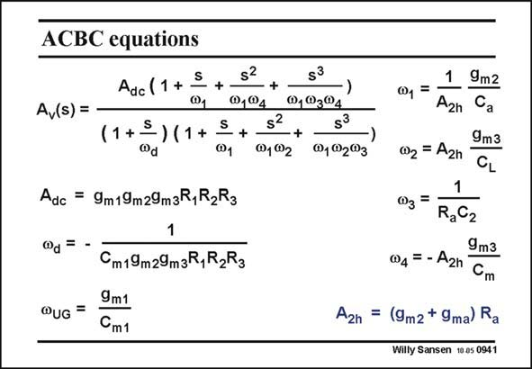

# SANSEN-0941 · ACBC equations Adc(1+ §

章节：09 多级运算放大器设计  
PDF 页：276；书本页：283；幻灯片编号：0941  
状态：unreviewed



## 对应教材讲解

### PDF 276 · 书本 283

The expression of the openloop gain A is given in this v slide. Now we have 4 poles and 3 zero’s. The first nondominant pole v coincides 1 with the first zero however, and will be cancelled out. Moreover, the next nondominant pole v increases 2 with gain A . Increasing 2h this gain shifts this nondominant pole to higher frequencies, allowing a higher GBW as well.

## 公式／性能结论候选摘录

以下为规则截取的原文，尚未逐项判读。

- PDF 276: The expression of the openloop gain A is given in this v slide.
- PDF 276: Moreover, the next nondominant pole v increases 2 with gain A .
- PDF 276: Increasing 2h this gain shifts this nondominant pole to higher frequencies, allowing a higher GBW as well.

## 曲线结论候选摘录

以下为规则截取的原文，尚未逐项判读。

（未由规则找到；不代表原页没有此类内容。）

## 原文条件与近似候选摘录

以下为规则截取的原文，尚未逐项判读。

（未由规则找到；不代表原页没有此类内容。）

## 幻灯片 OCR（未校正）

```text
ACBC equations
Adc(1+ §
+
@1
s?
@,®4
+
Av(s) =
(1+=) (1+
@d
S
@1
s?
@102
S3
@,®3®4
+
s3
@1®2®3
Adc = 9m19m29mzR,R2R3
@d = -
QUG =
Cm19m29m3R,R2R3
9m1
Cm1
1
@, =
A2n
002 = A2h
9m2
Ca
9m3
CL
@3 =
RaC2
9m3
04= - A2n Cm
A2n = (9m2+ 9ma) Ra
Willy Sansen 10.a5 0941
```

数学上下标、分数及正负号以原图为准。电路图已保留；未核对的连接不输出成可仿真 netlist。
