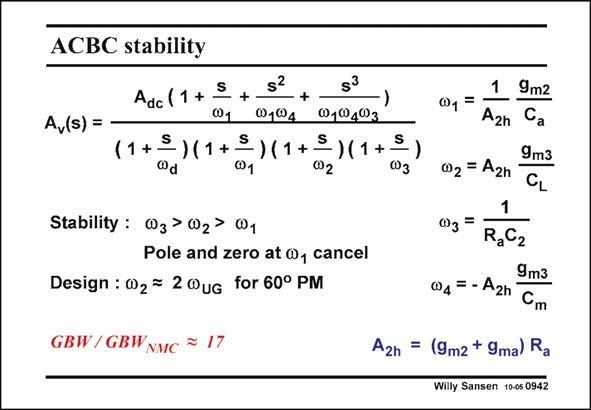

# SANSEN-0942 · ACBC stability

章节：09 多级运算放大器设计  
PDF 页：277；书本页：284；幻灯片编号：0942  
状态：unreviewed



## 对应教材讲解

### PDF 277 · 书本 284

First, for stability, we position the three non-dominant poles in an increasing order of magnitude. The nondominant pole v is thus the 3 highest one. This is possible as capacitance C is a small 2 parasitic node capacitance. Moreover, resistance R a cannot be made too large. It will be realized by means of a diode-connected MOST. In this case, it is clear that the first non-dominant pole v cancels the first zero. The 1 other zero’s are negligible. The design itself starts by positioning the first non-dominant pole v at two times the GBW, 2 as before for a maximally-flat 3rd-order Butterworth characteristic. The result is a considerable savings in power. Indeed the GBW is a factor 17 times larger than for a NMC amplifier with the same load capacitance and power consumption.

## 公式／性能结论候选摘录

以下为规则截取的原文，尚未逐项判读。

- PDF 277: The nondominant pole v is thus the 3 highest one.

## 曲线结论候选摘录

以下为规则截取的原文，尚未逐项判读。

- PDF 277: The design itself starts by positioning the first non-dominant pole v at two times the GBW, 2 as before for a maximally-flat 3rd-order Butterworth characteristic.

## 原文条件与近似候选摘录

以下为规则截取的原文，尚未逐项判读。

（未由规则找到；不代表原页没有此类内容。）

## 幻灯片 OCR（未校正）

```text
ACBC stability
Av(s) =
Adc (1 + = +
S
@,®4
@1@403
(1+=) (1+=) (1+=)(1+5
@d
@1
@2
Stability : (03 > 02> W1
Pole and zero at @, cancel
Design : W2 = 2 WuG for 60° PM
GBW/GBWNMC * 17
@1=
1
A2n
02 = A2n
9m2
Ca
9m3
CL
W3=
RaC2
9m3
04 = - A2h
Cm
A2h = (9m2 + 9ma) Ra
Willy Sansen 10-05 0942
```

数学上下标、分数及正负号以原图为准。电路图已保留；未核对的连接不输出成可仿真 netlist。
