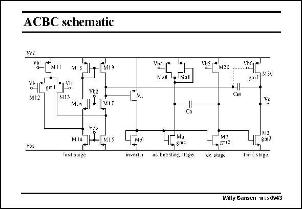

# SANSEN-0943 · ACBC schematic

章节：09 多级运算放大器设计  
PDF 页：277；书本页：284；幻灯片编号：0943  
状态：unreviewed



## 对应教材讲解

### PDF 277 · 书本 284

A possible circuit realization of a ACBC amplifier is shown in this slide. As usual, it starts with a folded cascode, with a current mirror as a second stage. The output stage is made class AB by connecting the Gate of transistor M30 to the output of the first stage. This greatly increases the output Slew Rate as well. The gain boosting stage consists of transistors Ma and Ma1. The gain is fairly precise. For a GBW of 2 MHz and a C of 500 pF, this gain A is about 9 with a C of 3 pF. Compensation capacitance L 2h a C itself is 10 pF and the total current consumption 160 mA. The current through M11 is 18 mA m and through M30 about 100 mA. The second stage has only 5 mA in each branch!

## 公式／性能结论候选摘录

以下为规则截取的原文，尚未逐项判读。

- PDF 277: This greatly increases the output Slew Rate as well.
- PDF 277: The gain boosting stage consists of transistors Ma and Ma1.
- PDF 277: The gain is fairly precise.
- PDF 277: For a GBW of 2 MHz and a C of 500 pF, this gain A is about 9 with a C of 3 pF.

## 曲线结论候选摘录

以下为规则截取的原文，尚未逐项判读。

（未由规则找到；不代表原页没有此类内容。）

## 原文条件与近似候选摘录

以下为规则截取的原文，尚未逐项判读。

（未由规则找到；不代表原页没有此类内容。）

## 幻灯片 OCR（未校正）

```text
ACBC schematic
Yde
N- EMI SS-M
Yb2
MI2
MI3
Yss
YoS
MI4-
HMIS
first stage
M:0
inverter
Mil lg kat
4-Mя
n8m2
ae beesting stage
vb5 *
M2C
8:nf] $30
Cm
M3
de stogs
thind stage
Willy Sansen 10.05 0943
```

数学上下标、分数及正负号以原图为准。电路图已保留；未核对的连接不输出成可仿真 netlist。
