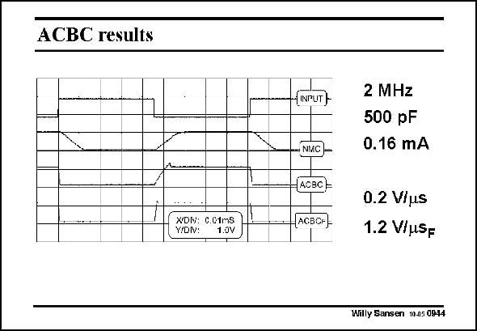

# SANSEN-0944 · ACBC results

章节：09 多级运算放大器设计  
PDF 页：278；书本页：285；幻灯片编号：0944  
状态：unreviewed



## 对应教材讲解

### PDF 278 · 书本 285

These transient measurement results show how important it is to have the feedforward with class-AB stage combination at the output. For a square input waveform, the output waveforms are displayed for the Gate of M30 connected to a DC biasing point (ACBC) and then for the Gate connected to the output of the first stage (ACBC ), labeled with F F of Feedforward. In the latter case, the Slew Rate is much higher and the rise time is much shorter.

## 公式／性能结论候选摘录

以下为规则截取的原文，尚未逐项判读。

（未由规则找到；不代表原页没有此类内容。）

## 曲线结论候选摘录

以下为规则截取的原文，尚未逐项判读。

（未由规则找到；不代表原页没有此类内容。）

## 原文条件与近似候选摘录

以下为规则截取的原文，尚未逐项判读。

（未由规则找到；不代表原页没有此类内容。）

## 幻灯片 OCR（未校正）

```text
ACBC results
XDM: C.0tms
Y!DIV:
1.0V
(INPUT)
2 MHz
500 pF
0.16 mA
-NMC,-
(40вC)-
-(ACBOн)
0.2 Vius
1.2 V/MSF
Willy Sansen 10.05 0944
```

数学上下标、分数及正负号以原图为准。电路图已保留；未核对的连接不输出成可仿真 netlist。
