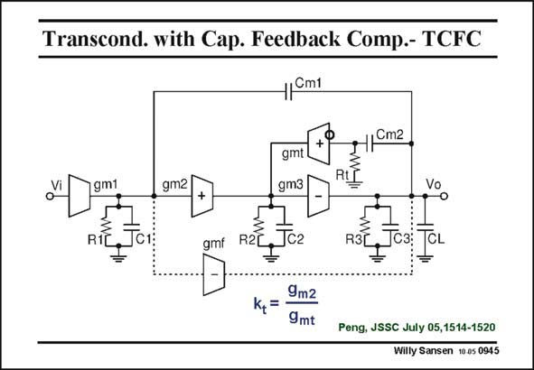

# SANSEN-0945 · Transcond. with Cap. Feedback Comp.- TCFC

章节：09 多级运算放大器设计  
PDF 页：278；书本页：285；幻灯片编号：0945  
状态：unreviewed



## 对应教材讲解

### PDF 278 · 书本 285

A final example of a lowpower three stage amplifier is the TCFC amplifier. It stands for Transconductance with Capacitance Feedback Compensation. The internal compensation capacitance does not short the second stage. It is fed back through a transconductance gmt. This is a cascode or current buffer, it has a low input resistance Rt= 1/gmt and a high output resistance. The characteristic variable is ratio k , which can be set quite accurately as it is a ratio of two transconductances of t pMOST transistors. Typical values are 2–3. Again, a feedforward block is used with transconductance gmf to cancel out a zero and to provide class AB biasing in the output stage. This transconductance gmf is close to gm3 of the output stage.

## 公式／性能结论候选摘录

以下为规则截取的原文，尚未逐项判读。

（未由规则找到；不代表原页没有此类内容。）

## 曲线结论候选摘录

以下为规则截取的原文，尚未逐项判读。

- PDF 278: The characteristic variable is ratio k , which can be set quite accurately as it is a ratio of two transconductances of t pMOST transistors.

## 原文条件与近似候选摘录

以下为规则截取的原文，尚未逐项判读。

（未由规则找到；不代表原页没有此类内容。）

## 幻灯片 OCR（未校正）

```text
Transcond. with Cap. Feedback Comp.- TCFC
1/Cm1
gm1
RIE
gm2
gmt
gm3
RLL
Vo
gmf
R2C
JC2
R3|
ky= 9mz
Peng, JSSC July 05,1514-1520
Willy Sansen 10 a5 0945
```

数学上下标、分数及正负号以原图为准。电路图已保留；未核对的连接不输出成可仿真 netlist。
