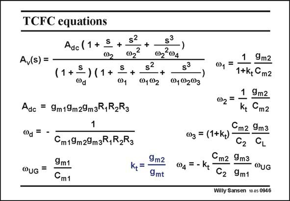

# SANSEN-0946 · TCFC equations Adc (1 + S

章节：09 多级运算放大器设计  
PDF 页：279；书本页：286；幻灯片编号：0946  
状态：unreviewed



## 对应教材讲解

### PDF 279 · 书本 286

The expression of the openloop gain is given in this slide. Again, we find 4 poles and 3 zero’s. The GBW is the same as for any threestage amplifier. The second non-dominant pole v coin- 2 cides with the first zero which occurs twice. One of them is now cancelled out. The other zero v will be 2 used to improve the phase margin. The right-hand zero v 4 contains the GBW. This zero is always a lot higher than the GBW, by factor k t and by the ratio’s C /C and g /g , which are both quite high. Indeed, compensation m2 2 m3 m1 capacitance C is always chosen larger than the parasitic node capacitance C . m2 2 This right-hand zero v is negligible. 4 The stability conditions are discussed next.

## 公式／性能结论候选摘录

以下为规则截取的原文，尚未逐项判读。

- PDF 279: The expression of the openloop gain is given in this slide.

## 曲线结论候选摘录

以下为规则截取的原文，尚未逐项判读。

- PDF 279: The other zero v will be 2 used to improve the phase margin.

## 原文条件与近似候选摘录

以下为规则截取的原文，尚未逐项判读。

（未由规则找到；不代表原页没有此类内容。）

## 幻灯片 OCR（未校正）

```text
TCFC equations
Adc (1 + S
+
s?
@2
Av(s) =
(1+{) (1+
@d
S
@1
+
Adc = 9m19m29mzR,R2R3
@d =
s?
@102
+
QUG =
Cm19m29m3R,R2R3
9m1
Cm1
9m2
K,=
9mt
S3
@1@2®3
1 9m2
@,=
1+k+ Cm2
1 9mг
02=
Kt
Cm2
03 = (1+k) Cm2 9m3
CL
@4 = - Kt
Cm2 9m3
@UG
C2 9m1
Willy Sansen 10a5 0946
```

数学上下标、分数及正负号以原图为准。电路图已保留；未核对的连接不输出成可仿真 netlist。
