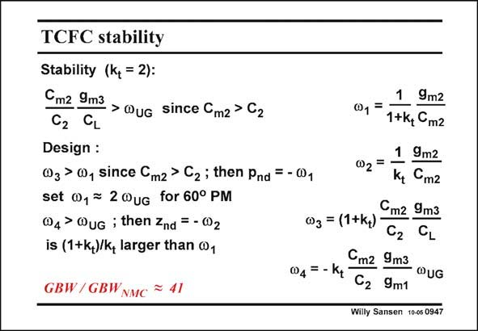

# SANSEN-0947 · TCFC stability Stability (k, = 2):

章节：09 多级运算放大器设计  
PDF 页：279；书本页：286；幻灯片编号：0947  
状态：unreviewed



## 对应教材讲解

### PDF 279 · 书本 286

For stability, we need to have the third non-dominant pole v larger than the 2 first one v . This is always 1 the case since k is larger t than unity. In the design example later on, a value of k is taken of two. t The main stability condition specifies that the second non-dominant pole v must 3 be larger than the GBW. This is easily satisfied as the ratio’s C /C and g /g m2 2 m3 m1 are large indeed. This circuit is therefore easy to stabilize! The most important non-dominant pole is v . For a 3rd-order Butterworth characteristic this 1 pole is positioned at 2 times the v (or the GBW). UG As discussed on the previous slide, the right-half-plane zero v is a lot larger than the GBW 4 and can now be neglected. The only zero left is a zero v in the left half of the complex plane. 2 It is only a little (actually (1+ k )/k or 1.5 times in this design) larger than the non-dominant t t pole. It is therefore ideally positioned to improve the phase margin. The resulting ratio in GBW compared to a conventional NMC amplifier is quite impressive.

## 公式／性能结论候选摘录

以下为规则截取的原文，尚未逐项判读。

- PDF 279: This circuit is therefore easy to stabilize!
- PDF 279: It is therefore ideally positioned to improve the phase margin.

## 曲线结论候选摘录

以下为规则截取的原文，尚未逐项判读。

- PDF 279: For a 3rd-order Butterworth characteristic this 1 pole is positioned at 2 times the v (or the GBW).
- PDF 279: It is therefore ideally positioned to improve the phase margin.

## 原文条件与近似候选摘录

以下为规则截取的原文，尚未逐项判读。

- PDF 279: UG As discussed on the previous slide, the right-half-plane zero v is a lot larger than the GBW 4 and can now be neglected.

## 幻灯片 OCR（未校正）

```text
TCFC stability
Stability (k, = 2):
Cmz 9m3 > WuG since Cm2 > C2
C2 CL
Design :
W3 > @, Since Cm2 > C2; then Pnd = - W,
set w, = 2 uG for 60° PM
04 >WuG ; then Znd = - 002
is (1+k,)/k, larger than ®,
GBW/ GBWNMC = 41
1
9m2
0,=.
1+kg Cm2
1
02 =
9m2
Kt
Cmг
Cmг 9m3
03 = (1+k+) -
C2
CL
Cm2 9m3
04=- Kt
@UG
C2 9m1
Willy Sansen 10-05 0947
```

数学上下标、分数及正负号以原图为准。电路图已保留；未核对的连接不输出成可仿真 netlist。
