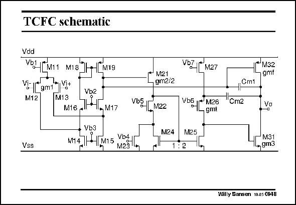

# SANSEN-0948 · TCFC schematic

章节：09 多级运算放大器设计  
PDF 页：280；书本页：287；幻灯片编号：0948  
状态：unreviewed



## 对应教材讲解

### PDF 280 · 书本 287

A circuit realization is shown in this slide. As usual, it starts with a folded cascode. A current mirror is used as a second stage. Output transistor M32 is driven by the output of the first stage. The output stage operates in class AB. Hence, it does not limit the Slew Rate. The Slew Rate will now be determined by the DC current of the first stage and compensation capacitance Cm1. The cascode is series with compensation capacitance Cm2 is realized with transistor M26. Its transconductance is twice the transconductance of transistor M21, which is the amplifying transistor of the second stage. Indeed, current mirror M24/M25 ensures a current ratio of two. Factor k is fairly precisely two t as well.

## 公式／性能结论候选摘录

以下为规则截取的原文，尚未逐项判读。

- PDF 280: Hence, it does not limit the Slew Rate.

## 曲线结论候选摘录

以下为规则截取的原文，尚未逐项判读。

（未由规则找到；不代表原页没有此类内容。）

## 原文条件与近似候选摘录

以下为规则截取的原文，尚未逐项判读。

（未由规则找到；不代表原页没有此类内容。）

## 幻灯片 OCR（未校正）

```text
TCFC schematic
Vdd
Vbl [(MI1 M18"
4 M19
vi Tom v+
Vb2
M12
M13
мG - I, м17
• Vb3
Vss
17 1 MmS NBSJ
Vb7 M27
!*М32
gmt
M21
, gm2/2
Vb [M22
M24
-0m1
'Om2
6 M26
M25
Vo
1:2
M31
,gm3
Willy Sansen 10.05 0948
```

数学上下标、分数及正负号以原图为准。电路图已保留；未核对的连接不输出成可仿真 netlist。
