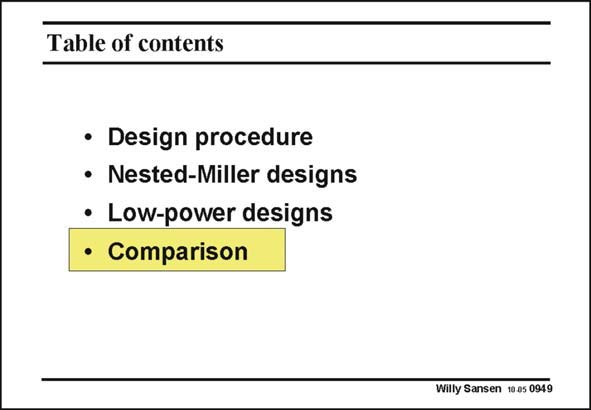

# SANSEN-0949 · Table of contents

章节：09 多级运算放大器设计  
PDF 页：280；书本页：287；幻灯片编号：0949  
状态：unreviewed



## 对应教材讲解

### PDF 280 · 书本 287

As many different configurations have been discussed, they have to be compared with some kind of Figure of Merit. Such a Figure of Merit normally includes the power dissipation for a certain GBW and load capacitance. However, two different FOMs exist. One of them takes into account the actual power dissipation in mW, whereas the other one takes only the current into account. The difference is the supply voltage used.

## 公式／性能结论候选摘录

以下为规则截取的原文，尚未逐项判读。

（未由规则找到；不代表原页没有此类内容。）

## 曲线结论候选摘录

以下为规则截取的原文，尚未逐项判读。

（未由规则找到；不代表原页没有此类内容。）

## 原文条件与近似候选摘录

以下为规则截取的原文，尚未逐项判读。

（未由规则找到；不代表原页没有此类内容。）

## 幻灯片 OCR（未校正）

```text
Table of contents
• Design procedure
• Nested-Miller designs
• Low-power designs
• Comparison
Willy Sansen 10.as 0949
```

数学上下标、分数及正负号以原图为准。电路图已保留；未核对的连接不输出成可仿真 netlist。
