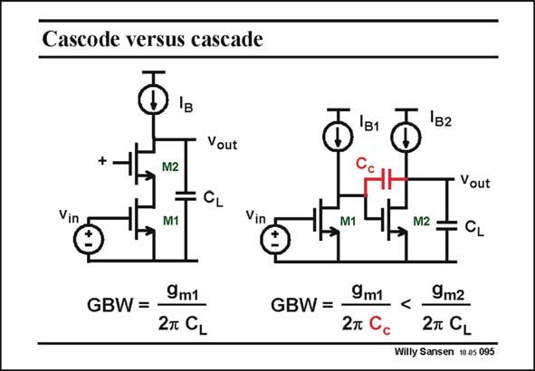

# SANSEN-095 · Cascode versus cascade

章节：09 多级运算放大器设计  
PDF 页：258；书本页：265；幻灯片编号：095  
状态：unreviewed



## 对应教材讲解

### PDF 258 · 书本 265

Addition of the same load capacitance C , shows that L the GBW of the cascode stage simply depends directly on this capacitance. A cascaded amplifier however, has two stages. A compensation capacitance is thus required to provide pole splitting for stability. As a consequence the output pole g /C will have to be m2 L two to three times larger than the GBW. More current will therefore be consumed. In general, addition of capacitances leads to additional current consumption. As said before, the cascaded stage allows a rail-to-rail output swing, which is a considerable advantage.

## 公式／性能结论候选摘录

以下为规则截取的原文，尚未逐项判读。

- PDF 258: Addition of the same load capacitance C , shows that L the GBW of the cascode stage simply depends directly on this capacitance.
- PDF 258: A compensation capacitance is thus required to provide pole splitting for stability.
- PDF 258: More current will therefore be consumed.

## 曲线结论候选摘录

以下为规则截取的原文，尚未逐项判读。

（未由规则找到；不代表原页没有此类内容。）

## 原文条件与近似候选摘录

以下为规则截取的原文，尚未逐项判读。

（未由规则找到；不代表原页没有此类内容。）

## 幻灯片 OCR（未校正）

```text
Cascode versus cascade
Iв
Vout
1в10
Vin
M2
M1
Vin
M1
Vout
M2=
+ CL
GBW =
9m1
2T CL
GBW =
9m1
2m C
<9mг
2m CL
Willy Sansen 10 as 095
```

数学上下标、分数及正负号以原图为准。电路图已保留；未核对的连接不输出成可仿真 netlist。
