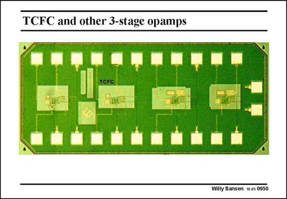

# SANSEN-0950 · TCFC and other 3-stage opamps

章节：09 多级运算放大器设计  
PDF 页：281；书本页：288；幻灯片编号：0950  
状态：unreviewed



## 对应教材讲解

### PDF 281 · 书本 288

Such a comparison has been made based on experimental results only. In this layout, several opamps can be distinguished, among which is the TCFC one. They all have similar sizes, as the load capacitances were 150 pF for all of them. The technology was 0.35 mm CMOS. The comparison is better carried out in a Table as shown next.

## 公式／性能结论候选摘录

以下为规则截取的原文，尚未逐项判读。

（未由规则找到；不代表原页没有此类内容。）

## 曲线结论候选摘录

以下为规则截取的原文，尚未逐项判读。

（未由规则找到；不代表原页没有此类内容。）

## 原文条件与近似候选摘录

以下为规则截取的原文，尚未逐项判读。

（未由规则找到；不代表原页没有此类内容。）

## 幻灯片 OCR（未校正）

```text
TCFC and other 3-stage opamps
TCFC
Willy Sansen 1005 0950
```

数学上下标、分数及正负号以原图为准。电路图已保留；未核对的连接不输出成可仿真 netlist。
