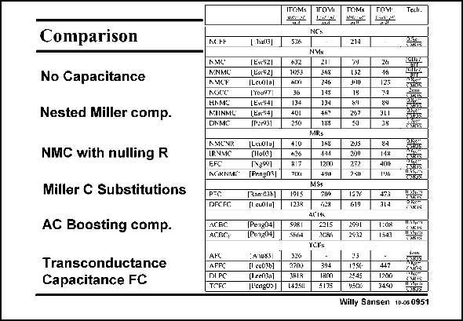

# SANSEN-0951 · Comparison

章节：09 多级运算放大器设计  
PDF 页：281；书本页：288；幻灯片编号：0951  
状态：unreviewed



## 对应教材讲解

### PDF 281 · 书本 288

For this purpose the several three-stage opamps have been put in categories. All possible Figures-of-Merit have been added. Not only a choice is made between the current (mA) or the power (mW) consumption. Another alternative is to use either the GBW, which is a quality factor for small signals, or the Slew Rate, which is more important for largesignal operation, such as in switched-capacitor circuits. The first category uses no compensation capacitance. It is clear that this is not the way to go! The second category is the most used one. It lists all the NMC varieties. Several of them have been discussed in this Chapter. The FOMs are reasonably good. The best one is the multi-path opamp MNMC. However, its Slew Rate is not so good, because no feedforward stage is used to turn the output stage into a class-AB stage. The addition of nulling resistances in series with the compensation capacitance does not increase the FOM a lot. Real improvements are only achieved once left-hand-plane zero’s can be generated, which compensate the main non-dominant pole. This is the case when positive feedback is used (PFC) or damping-factor control (DFCFC). This is even more the case when a AC boosting amplifier

### PDF 282 · 书本 289

is used (ACBC) or additional transconductance blocks, as in Active feedback compensation (AFC) and especially transconductance and capacitances compensation (TCFC). The results are obvious.

## 公式／性能结论候选摘录

以下为规则截取的原文，尚未逐项判读。

- PDF 281: The addition of nulling resistances in series with the compensation capacitance does not increase the FOM a lot.

## 曲线结论候选摘录

以下为规则截取的原文，尚未逐项判读。

（未由规则找到；不代表原页没有此类内容。）

## 原文条件与近似候选摘录

以下为规则截取的原文，尚未逐项判读。

（未由规则找到；不代表原页没有此类内容。）

## 幻灯片 OCR（未校正）

```text
Comparison
No Capacitance
Nested Miller comp.
NMC with nulling R
Miller C Substitutions
AC Boosting comp.
Transconductance
Capacitance FC
Tech.
N.tF
114051
AMC'
MNMC
ANCF
NOCC
HAMG
MIINML
DNMC
1Ese921
LLic421
(Lecdlal
[Youa'T
(Exe%41
(Bxc*4]
(R9931
AMCNIt [Ladlul
IRNME
(H003)
EFC
Ng991
ACiKNMr" [Panpml
PEc
DREFC
Ran:0361
[I euala]
AGBC
АСВС)
[PeI804І
(Peng04)
AFPC
DIPC
TOFC
14nu83
(І есо3b]
(1ceh5a)
[Ucagos]
ITOM:
5.36
$32
10S3
hixI
36
134
401
250
410
+26
817
7ix1
IГOMI
TOMS
NG:
NMS
21
168
246
14S
134
+67
188
MRs
148
1200
MSs
ГOY
214
192
300
15
267
AJS
272
251
SIRI
5664
YCRS
320
3702
SRIS
142.541
394
Tam
5175
24
125
84
3L1
38
SEX
diins
84
T4X
400
473
314
1:08
1547
1950
X$45
VACK
447
1200
34.5)
vias
LASXIN
Willy Sansen 10.050951
```

数学上下标、分数及正负号以原图为准。电路图已保留；未核对的连接不输出成可仿真 netlist。
