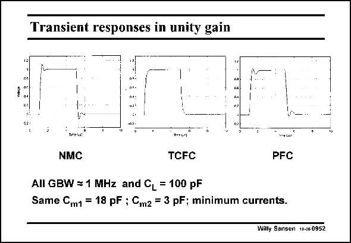

# SANSEN-0952 · Transient responses in unity gain

章节：09 多级运算放大器设计  
PDF 页：282；书本页：289；幻灯片编号：0952  
状态：unreviewed



## 对应教材讲解

### PDF 282 · 书本 289

The transient responses of these amplifiers are related to the pole-zero positions but not always in a straightforward way. The responses of three amplifiers are given in this slide for the same GBW and load capacitance. They also use the same 3rdorder Butterworth frequency response and the same compensation capacitances. As a result, the current in the NMC is a lot larger than in the other two, as discussed before. The time responses show that the NMC and PFC amplifier show some overshoot, whereas the TCFC amplifier does not. This is a result of small differences in the pole-zero positions.

## 公式／性能结论候选摘录

以下为规则截取的原文，尚未逐项判读。

- PDF 282: As a result, the current in the NMC is a lot larger than in the other two, as discussed before.

## 曲线结论候选摘录

以下为规则截取的原文，尚未逐项判读。

（未由规则找到；不代表原页没有此类内容。）

## 原文条件与近似候选摘录

以下为规则截取的原文，尚未逐项判读。

（未由规则找到；不代表原页没有此类内容。）

## 幻灯片 OCR（未校正）

```text
Transient responses in unity gain
44:
Tereix!
necr'
NMC
TCFC
PFC
All GBW = 1 MHz and CL = 100 pF
Same Cm1 = 18 pF ; Cm2 = 3 pF; minimum currents.
Willy Sansen 10.05 0952
```

数学上下标、分数及正负号以原图为准。电路图已保留；未核对的连接不输出成可仿真 netlist。
