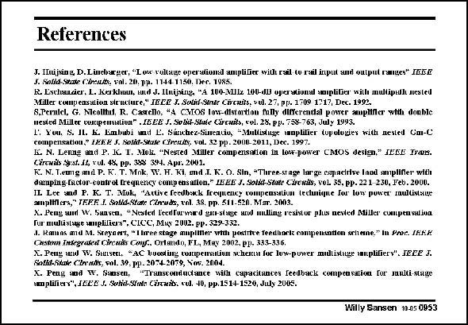

# SANSEN-0953 · References

章节：09 多级运算放大器设计  
PDF 页：282；书本页：289；幻灯片编号：0953  
状态：unreviewed



## 对应教材讲解

### PDF 282 · 书本 289

All important references are collected here. Most of them are from the IEEE Journal of Solid-State Circuits. A few are from the Transactions on Circuits and Systems and also from the Custom Integrated Circuits Conference.

## 公式／性能结论候选摘录

以下为规则截取的原文，尚未逐项判读。

（未由规则找到；不代表原页没有此类内容。）

## 曲线结论候选摘录

以下为规则截取的原文，尚未逐项判读。

（未由规则找到；不代表原页没有此类内容。）

## 原文条件与近似候选摘录

以下为规则截取的原文，尚未逐项判读。

（未由规则找到；不代表原页没有此类内容。）

## 幻灯片 OCR（未校正）

```text
References
J. Inцijsinu, D.Lincbarger, 'Low voltage opersaiond amplifer with rail to rail irput and output ranges" TEEE
J. Salid.Stale Clmuuits, vol. 20. pp. 1144-1150. Dec. 1985.
R. Eschaucier, L. Kerkhum, utd J. Inijsing, "A 100-VIIx 10U-dD operational oplitier with multipiul nested
Miller compensslion siructure," IEED J. Sotid-Stnie Cacuis, vul. 27, Pp. 1709 1717, Dec. 1992.
8,Peraicl, G. Nicollhil, R. Casello, *4 CVTOS low-distorton fally differendal pover amphfer with doble
nesied Millec vostponsuton" .ICRE J. Sobit-Stale Circuits, vwl. 28, pp. 768-763, July 1993.
L: Xou. S. II. K. Embubi und L. Súnchez-Sineacio, "Muklisuge inoplitier topolozies with gexted Cm-C
compensation." URKR J. Solid-Stale Ciretity, vol. 32 pp. 2000.2011, Dec. 1997.
K. N. Lemug and P. I. T. Mok. "Nested Miller compensation in low-power CMOS desien," IEEL Irus.
Circuibs Syxt. 11, vul. 4%, pp. 385 394. Apr. 200)1.
K. N. T.eung md P. K. T. Mok, W. H. K1, mnd .T. K. O. Sin, "Three-srage large capacirise lnod amplifer with
datuping-ractor-control trequengy compensation." LEEE J. Sollt-State Cacuüs, vol. 35, pp. 22 1- 230, F'eb. 2000.
IL. Lee und P. K. T. Mok, "Aelive feedbick Irequeney compensstiun techmique for low power caultistage
anpllflers," TKF.R .J. Solld-Stat CZaruds, vol. 38. pp. 511-520. Mar. 2003.
X. Peng und W, Saasen, "Nested leedforme'd ono-stame mod muline resistor plus nexted Miller cumpensation
Tur multistsge anpliliers*, CICC, Mus 2002. pp. 329-332.
J. Ramos md M. Sreyeert, "Free stage aupiller vith pocrtue feedhack compensation scheme." In Proc. fkKl
Castem Iekegraled Circuls Coys. Ortando, F'L, May 2002, Pp. 333-336.
X. Peng ww W. Susen, "AC boosting copensution scheta for low-power mudtistuge uuplifery". JECE J.
Sol6d-Rkak: Cilrerdt, pol. 39, pp. 2074.2079, Sov. 2004.
X. Peng and IV. Sansen,
"Transconducance with canacitances Ieedback compensation for multi-stage
annplifiers", JBLD J. Sohd-Sfnte Circeib: cul. 40, pp.1514-1520, July 2005.
Willy Sansen 1005 0953
```

数学上下标、分数及正负号以原图为准。电路图已保留；未核对的连接不输出成可仿真 netlist。
