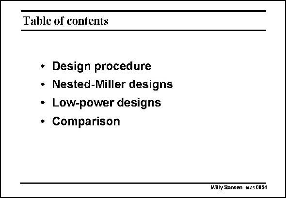

# SANSEN-0954 · Table of contents

章节：09 多级运算放大器设计  
PDF 页：283；书本页：290；幻灯片编号：0954  
状态：unreviewed



## 对应教材讲解

### PDF 283 · 书本 290

As a conclusion, this Chapter has been devoted to three-stage operational amplifiers. Considerable attention has been paid to the stability of such amplifiers. At least two zero’s are always generated, in addition to three poles. Conventional Miller compensation is discussed next, followed by several derivatives. Their main disadvantage is the power consumption in the third stage. To reduce power consumption, several more configurations are discussed. They all have 4 poles and 3 zero’s. They all exploit the cancellation effect of one non-dominant pole by a zero. Moreover, they all position a left-hand-plane zero close to the next non-dominant pole. In this way, the power consumption can be reduced considerably. In the best case (in a TCFC amplifier) the power consumption can be reduced by up to a factor of 40, compared to a conventional Nested Miller Compensation amplifier.

## 公式／性能结论候选摘录

以下为规则截取的原文，尚未逐项判读。

- PDF 283: As a conclusion, this Chapter has been devoted to three-stage operational amplifiers.

## 曲线结论候选摘录

以下为规则截取的原文，尚未逐项判读。

（未由规则找到；不代表原页没有此类内容。）

## 原文条件与近似候选摘录

以下为规则截取的原文，尚未逐项判读。

（未由规则找到；不代表原页没有此类内容。）

## 幻灯片 OCR（未校正）

```text
Table of contents
• Design procedure
• Nested-Miller designs
• Low-power designs
• Comparison
Willy Sansen 1005 0954
```

数学上下标、分数及正负号以原图为准。电路图已保留；未核对的连接不输出成可仿真 netlist。
