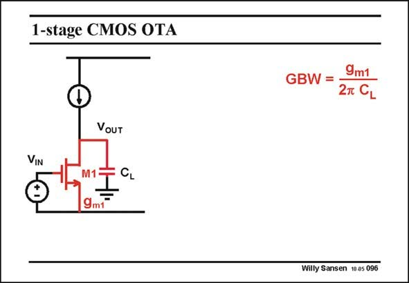

# SANSEN-096 · 1-stage CMOS OTA

章节：09 多级运算放大器设计  
PDF 页：258；书本页：265；幻灯片编号：096  
状态：unreviewed



## 对应教材讲解

### PDF 258 · 书本 265

In order to create a feeling on how a three-stage amplifier is stabilized, the principles are reviewed for a single-and two-stage amplifier. A single-stage amplifier has only one single highimpedance point at the output. The output capacitance C determines the L GBW. In the case of variable load capacitances, as in switched-capacitor filters, we do not want the GBW to depend on the load. A two-stage opamp is then better used.

## 公式／性能结论候选摘录

以下为规则截取的原文，尚未逐项判读。

- PDF 258: In the case of variable load capacitances, as in switched-capacitor filters, we do not want the GBW to depend on the load.

## 曲线结论候选摘录

以下为规则截取的原文，尚未逐项判读。

（未由规则找到；不代表原页没有此类内容。）

## 原文条件与近似候选摘录

以下为规则截取的原文，尚未逐项判读。

（未由规则找到；不代表原页没有此类内容。）

## 幻灯片 OCR（未校正）

```text
1-stage CMOS OTA
GBW =
9m1
2T CL
VOUT
VIN
M1=
9mF
Willy Sansen 10.a5 096
```

数学上下标、分数及正负号以原图为准。电路图已保留；未核对的连接不输出成可仿真 netlist。
