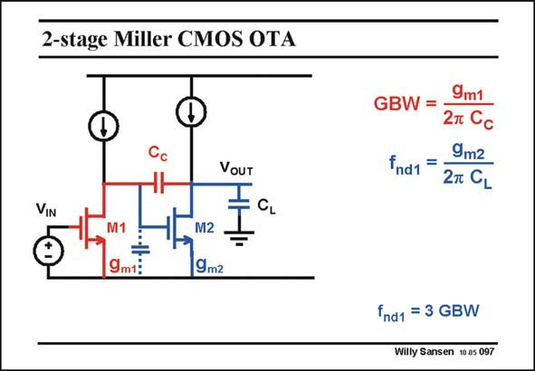

# SANSEN-097 · 2-stage Miller CMOS OTA

章节：09 多级运算放大器设计  
PDF 页：259；书本页：266；幻灯片编号：097  
状态：unreviewed



## 对应教材讲解

### PDF 259 · 书本 266

A two-stage amplifier has two high-impedance points. They need to be connected by a compensation capacitance C to provide pole c splitting and to generate a dominant pole. The GBW is therefore determined by this compensation capacitance C . c For stability, the nondominant pole is now determined by the load capacitance C . It must be L sufficiently large compared to the GBW, to provide a sufficient phase margin. A ratio of three is taken for a phase margin of about 70°. Since we have two stages, we have two time constants. They are the ones for the GBW and the one for the non-dominant pole. The latter one is the output time constant. It is the output g divided by the load capacitance C . It is normally set at two to three times the GBW m3 L depending on the phase margin required.

## 公式／性能结论候选摘录

以下为规则截取的原文，尚未逐项判读。

- PDF 259: The GBW is therefore determined by this compensation capacitance C . c For stability, the nondominant pole is now determined by the load capacitance C .
- PDF 259: It is normally set at two to three times the GBW m3 L depending on the phase margin required.

## 曲线结论候选摘录

以下为规则截取的原文，尚未逐项判读。

- PDF 259: It must be L sufficiently large compared to the GBW, to provide a sufficient phase margin.
- PDF 259: A ratio of three is taken for a phase margin of about 70°.
- PDF 259: It is normally set at two to three times the GBW m3 L depending on the phase margin required.

## 原文条件与近似候选摘录

以下为规则截取的原文，尚未逐项判读。

（未由规则找到；不代表原页没有此类内容。）

## 幻灯片 OCR（未校正）

```text
2-stage Miller CMOS OTA
VOUT
VIN
CL
÷
9m1:
M2
19m2
9m1
GBW =
2т Cс
9m2
fnd1 =
27 CL
fnd1 = 3 GBW
Willy Sansen 10as 097
```

数学上下标、分数及正负号以原图为准。电路图已保留；未核对的连接不输出成可仿真 netlist。
