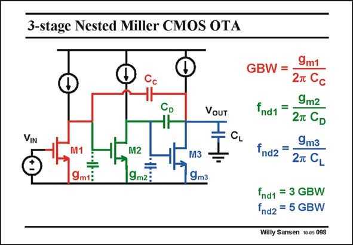

# SANSEN-098 · 3-stage Nested Miller CMOS OTA

章节：09 多级运算放大器设计  
PDF 页：259；书本页：266；幻灯片编号：098  
状态：unreviewed



## 对应教材讲解

### PDF 259 · 书本 266

We now have three stages, we can expect three time constants. They will be the ones for the GBW and now for two non-dominant poles. Since three high-impedance points are present, two compensation capacitances are required for stability. Both are connected to the output. This is called nested- Miller compensation. Indeed the GBW has the same expression as before. The reason is that the compensation capacitance connects the output to the output of the input transistor. It shunts both transistors M2 and M3. Transistor M2 is a kind of driver for transistor M3. Together they form the output stage. The output time constant is the same as well. It is again the output g divided by the load m3 capacitance C , exactly as for a two-stage amplifier. L

### PDF 260 · 书本 267

The middle stage now brings in another time constant, also given by its g divided by its m2 own output capacitance C . D As a result, we find two non-dominant poles. Both have to be positioned sufficiently far beyond the GBW, such that together they provide a reasonable phase margin. Ratio’s of 3 and 5 have been taken in this slide. Why these values is shown next.

## 公式／性能结论候选摘录

以下为规则截取的原文，尚未逐项判读。

- PDF 260: D As a result, we find two non-dominant poles.

## 曲线结论候选摘录

以下为规则截取的原文，尚未逐项判读。

- PDF 260: Both have to be positioned sufficiently far beyond the GBW, such that together they provide a reasonable phase margin.

## 原文条件与近似候选摘录

以下为规则截取的原文，尚未逐项判读。

（未由规则找到；不代表原页没有此类内容。）

## 幻灯片 OCR（未校正）

```text
3-stage Nested Miller CMOS OTA
GBW =
VOUT
VIN
CL
9m1:
M2
9m2:
M3
9m3
9m2
ind1 =
27 CD
9m3
fnd2 =
2т CL
fnd1 = 3 GBW
fnd2 = 5 GBW
Willy Sansen 10.05 098
```

数学上下标、分数及正负号以原图为准。电路图已保留；未核对的连接不输出成可仿真 netlist。
