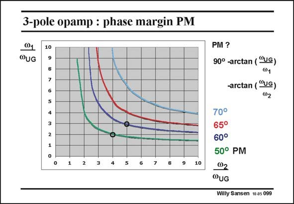

# SANSEN-099 · 3-pole opamp : phase margin PM

章节：09 多级运算放大器设计  
PDF 页：260；书本页：267；幻灯片编号：099  
状态：unreviewed



## 对应教材讲解

### PDF 260 · 书本 267

The curves for equal phase margin PM for different combinations of the two non-dominant poles are shown in this slide. The (circle) frequencies of the non-dominant poles are scaled by one of the GBW. It is clear that for a PM of 60°, one non-dominant pole has to be positioned at 3 times the GBW and the other one at 5 times the GBW (see dot). Obviously, all other combinations of the same (blue) curve provide the same PM of 60°. This means that all these combinations give about the same amount of peaking in the transient response. Ratio’s of 3.5 and 4 are therefore perfectly acceptable. Ratio’s of 2.5 and 7 would also be acceptable but positioning a non-dominant pole at 7 times the GBW would probably require too much power. This combination is better avoided. It is also clear that a PM of about 60° is sufficiently high, even if a bit of peaking occurs. A PM of 70° would require non-dominant poles at too high frequencies, and would consume too much power. Many designers take an even higher risk by requiring a PM of only 50°. In this case, the transient response is really on the edge of peaking. The non-dominant poles can then be positioned at 2 and 4 times the GBW only (see dot)! This is called the Butterworth response. It provides a maximally flat response once the feedback loop is closed towards unity gain. It is often used for the design of three-stage amplifiers although it may not yield the lowest power consumption.

## 公式／性能结论候选摘录

以下为规则截取的原文，尚未逐项判读。

- PDF 260: The curves for equal phase margin PM for different combinations of the two non-dominant poles are shown in this slide.
- PDF 260: Ratio’s of 3.5 and 4 are therefore perfectly acceptable.
- PDF 260: It provides a maximally flat response once the feedback loop is closed towards unity gain.

## 曲线结论候选摘录

以下为规则截取的原文，尚未逐项判读。

- PDF 260: The curves for equal phase margin PM for different combinations of the two non-dominant poles are shown in this slide.
- PDF 260: Obviously, all other combinations of the same (blue) curve provide the same PM of 60°.
- PDF 260: This means that all these combinations give about the same amount of peaking in the transient response.
- PDF 260: It is also clear that a PM of about 60° is sufficiently high, even if a bit of peaking occurs.
- PDF 260: In this case, the transient response is really on the edge of peaking.

## 原文条件与近似候选摘录

以下为规则截取的原文，尚未逐项判读。

（未由规则找到；不代表原页没有此类内容。）

## 幻灯片 OCR（未校正）

```text
3-pole opamp : phase margin PM
@1
@UG
10
7
6
4
1
2
10
PM?
90° -arctan (°UG)
@1
-arctan (®UG)
02
70°
65°
60°
50° PM
@2
@UG
Willy Sansen 10.as 099
```

数学上下标、分数及正负号以原图为准。电路图已保留；未核对的连接不输出成可仿真 netlist。
