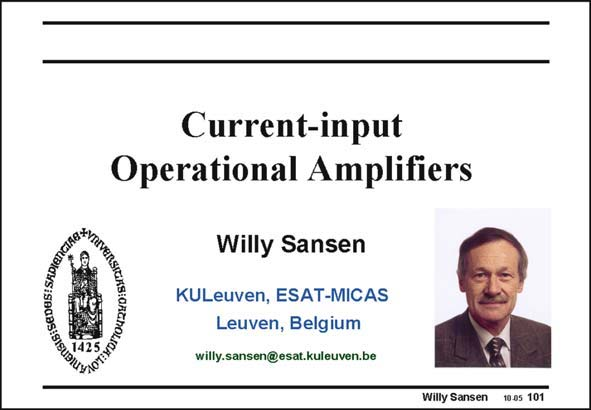

# SANSEN-101 · Slide 101

章节：10 电流输入型运算放大器  
PDF 页：284；书本页：291；幻灯片编号：101  
状态：unreviewed



## 对应教材讲解

### PDF 284 · 书本 291

Instead of voltages, currents can be used at the inputs as well. They lead to currentinput amplifiers. They are discussed in this Chapter.

## 公式／性能结论候选摘录

以下为规则截取的原文，尚未逐项判读。

（未由规则找到；不代表原页没有此类内容。）

## 曲线结论候选摘录

以下为规则截取的原文，尚未逐项判读。

（未由规则找到；不代表原页没有此类内容。）

## 原文条件与近似候选摘录

以下为规则截取的原文，尚未逐项判读。

（未由规则找到；不代表原页没有此类内容。）

## 幻灯片 OCR（未校正）

```text
Current-input
Operational Amplifiers
Willy Sansen
KULeuven, ESAT-MICAS
Leuven, Belgium
willy.sansen@esat.kuleuven.be
Willy Sansen
10.05 101
```

数学上下标、分数及正负号以原图为准。电路图已保留；未核对的连接不输出成可仿真 netlist。
