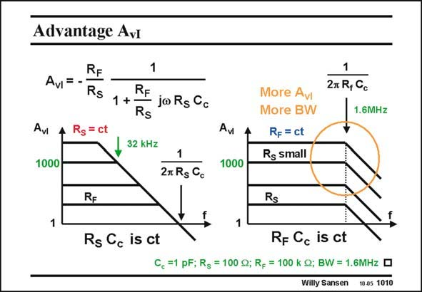

# SANSEN-1010 · Advantage Avi

章节：10 电流输入型运算放大器  
PDF 页：288；书本页：295；幻灯片编号：1010  
状态：unreviewed



## 对应教材讲解

### PDF 288 · 书本 295

On the left, the same voltage opamp is taken from the previous slide. On the right, we use the same current opamp but we now vary R S to set the gain. The feedback resistor R is kept constant, F at a value of 100 kV. We now we have an amplifier with a constant bandwidth, rather than with constant gain-bandwidth. The bandwidth is determined by the R C time F c constant. It is clear that with this current opamp, we can reach combinations of large gain and high speed, which are not available with a voltage opamp. This is a clear advantage. For a gain of 1000, the bandwidth now extends to 1.6 MHz, rather than to 32 kHz, which is an enormous increase.

## 公式／性能结论候选摘录

以下为规则截取的原文，尚未逐项判读。

- PDF 288: On the right, we use the same current opamp but we now vary R S to set the gain.
- PDF 288: We now we have an amplifier with a constant bandwidth, rather than with constant gain-bandwidth.
- PDF 288: The bandwidth is determined by the R C time F c constant.
- PDF 288: It is clear that with this current opamp, we can reach combinations of large gain and high speed, which are not available with a voltage opamp.
- PDF 288: For a gain of 1000, the bandwidth now extends to 1.6 MHz, rather than to 32 kHz, which is an enormous increase.

## 曲线结论候选摘录

以下为规则截取的原文，尚未逐项判读。

（未由规则找到；不代表原页没有此类内容。）

## 原文条件与近似候选摘录

以下为规则截取的原文，尚未逐项判读。

（未由规则找到；不代表原页没有此类内容。）

## 幻灯片 OCR（未校正）

```text
Advantage Avi
AvI =
RF
Rs
Rs
= ct
Avi
1000
1
RF
1 +
joRs Cc
Rs
32 kHz
1|
2x Rs Cc
Aw
1000
More Avi
More BW
Rp = ct
Rs small
1
27 R, Cc
1.6MHz
RE
Rs Cc is ct
Rs
Rp Cc is ct
C, =1 pF; Rg = 100 g; R, = 100 k Q; BW = 1.6MHz D
Willy Sansen
10 05 1010
```

数学上下标、分数及正负号以原图为准。电路图已保留；未核对的连接不输出成可仿真 netlist。
