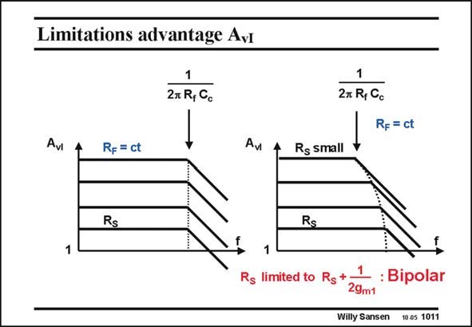

# SANSEN-1011 · Limitations advantage Avi

章节：10 电流输入型运算放大器  
PDF 页：289；书本页：296；幻灯片编号：1011  
状态：unreviewed



## 对应教材讲解

### PDF 289 · 书本 296

For this gain of 1000, The value of R is now 100 V. S For higher gains, this resistor has to be even smaller. This is not so easy as the input resistance 1/2g of m1 the circuit starts playing a role. As a consequence, these high speeds are not easily realized at high gain values. The curves bend to the left. The gain is still large in practice, but not as large as expected. Also, bipolar transistors have lower input resistances. They can therefore be used towards higher gain-bandwidth combinations. This is why most commercial current opamps are in bipolar technology.

## 公式／性能结论候选摘录

以下为规则截取的原文，尚未逐项判读。

- PDF 289: For this gain of 1000, The value of R is now 100 V.
- PDF 289: As a consequence, these high speeds are not easily realized at high gain values.
- PDF 289: The gain is still large in practice, but not as large as expected.
- PDF 289: They can therefore be used towards higher gain-bandwidth combinations.

## 曲线结论候选摘录

以下为规则截取的原文，尚未逐项判读。

- PDF 289: The curves bend to the left.

## 原文条件与近似候选摘录

以下为规则截取的原文，尚未逐项判读。

（未由规则找到；不代表原页没有此类内容。）

## 幻灯片 OCR（未校正）

```text
Limitations advantage Avi
1
27 R, Cc
1
2x R, Gc
Rp = ct
Avi
Rp = ct
Av
Rs small
Rs
Rs
1
1
Rs limited to Rg +
: Bipolar
29m1
Willy Sansen 100s 1011
```

数学上下标、分数及正负号以原图为准。电路图已保留；未核对的连接不输出成可仿真 netlist。
