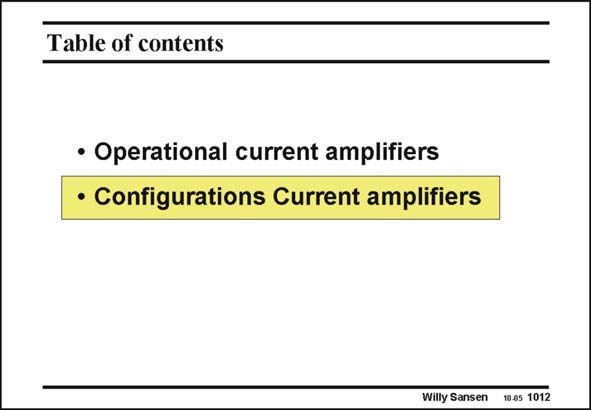

# SANSEN-1012 · Table of contents

章节：10 电流输入型运算放大器  
PDF 页：289；书本页：296；幻灯片编号：1012  
状态：unreviewed



## 对应教材讲解

### PDF 289 · 书本 296

Now that the advantages are known for current opamps, let us have a look at some realizations.

## 公式／性能结论候选摘录

以下为规则截取的原文，尚未逐项判读。

（未由规则找到；不代表原页没有此类内容。）

## 曲线结论候选摘录

以下为规则截取的原文，尚未逐项判读。

（未由规则找到；不代表原页没有此类内容。）

## 原文条件与近似候选摘录

以下为规则截取的原文，尚未逐项判读。

（未由规则找到；不代表原页没有此类内容。）

## 幻灯片 OCR（未校正）

```text
Table of contents
• Operational current amplifiers
• Configurations Current amplifiers
Willy Sansen
10.05 1012
```

数学上下标、分数及正负号以原图为准。电路图已保留；未核对的连接不输出成可仿真 netlist。
