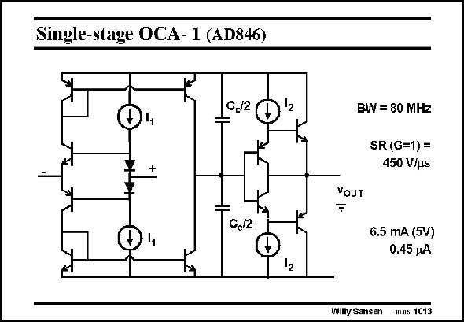

# SANSEN-1013 · Single-stage OCA- 1 (AD846)

章节：10 电流输入型运算放大器  
PDF 页：290；书本页：297；幻灯片编号：1013  
状态：unreviewed



## 对应教材讲解

### PDF 290 · 书本 297

This is a single-stage current operational amplifier in bipolar technology. The bandwidth is set by the two capacitors at the output. It is 80 MHz. Obviously, the Slew Rate is large as well. For a closedloop gain of 1, it is 450 V/ms! The output stage consists of a double emitter follower. As usual, with high-speed amplifiers, no noise specification is given.

## 公式／性能结论候选摘录

以下为规则截取的原文，尚未逐项判读。

- PDF 290: The bandwidth is set by the two capacitors at the output.
- PDF 290: For a closedloop gain of 1, it is 450 V/ms!

## 曲线结论候选摘录

以下为规则截取的原文，尚未逐项判读。

（未由规则找到；不代表原页没有此类内容。）

## 原文条件与近似候选摘录

以下为规则截取的原文，尚未逐项判读。

（未由规则找到；不代表原页没有此类内容。）

## 幻灯片 OCR（未校正）

```text
Single-stage OCA- 1 (AD846)
C/2Đ2
+
C./2
12
BW = 80 MHz
SR (G=1)=
450 V/us
YoUT
6.5 mA (5V)
0.45 jA
Willy Sansen
mns 1013
```

数学上下标、分数及正负号以原图为准。电路图已保留；未核对的连接不输出成可仿真 netlist。
