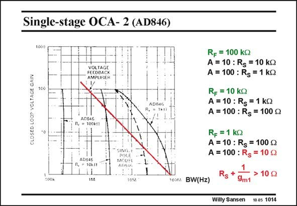

# SANSEN-1014 · Single-stage OCA- 2 (AD846)

章节：10 电流输入型运算放大器  
PDF 页：290；书本页：297；幻灯片编号：1014  
状态：unreviewed



## 对应教材讲解

### PDF 290 · 书本 297

The specifications of this amplifier clearly show the constant-bandwidth behavior. For example, for a R = F 100 kV. The bandwidth is just over 200 kHz. It does not depend on the actual gain. Curves are also given for R =10 kV and 1 kV. It is F clear that for the latter, a gain of 100 is not easily obtained. Indeed, for this value of R , a gain of 100 F would necessitate a R of a S mere 10 V! In this case, the input resistance of the amplifier takes over. The curve bends to the left. At a gain of 100, a bandwidth of 4 MHz results, which would require a GBW of 400 MHz if it were a voltage amplifier.

## 公式／性能结论候选摘录

以下为规则截取的原文，尚未逐项判读。

- PDF 290: The specifications of this amplifier clearly show the constant-bandwidth behavior.
- PDF 290: The bandwidth is just over 200 kHz.
- PDF 290: It does not depend on the actual gain.
- PDF 290: It is F clear that for the latter, a gain of 100 is not easily obtained.
- PDF 290: Indeed, for this value of R , a gain of 100 F would necessitate a R of a S mere 10 V!
- PDF 290: At a gain of 100, a bandwidth of 4 MHz results, which would require a GBW of 400 MHz if it were a voltage amplifier.

## 曲线结论候选摘录

以下为规则截取的原文，尚未逐项判读。

- PDF 290: Curves are also given for R =10 kV and 1 kV.
- PDF 290: The curve bends to the left.

## 原文条件与近似候选摘录

以下为规则截取的原文，尚未逐项判读。

（未由规则找到；不代表原页没有此类内容。）

## 幻灯片 OCR（未校正）

```text
Single-stage OCA- 2 (AD846)
1000
CLOSEO LOOP VOLTAGE GAIN
VOLTAGE
FEEOBACK
1C0
ADBAG
MOUF!
R, - 10k.11
BW(Hz)
RF = 100 KQ
A = 10 : Rs = 10 kQ
A = 100 : Rg = 1 kQ
Rf = 10 kQ
A = 10 : Rg = 1 kQ
A = 100 : Rg = 100 g
R, =1 kQ
A = 10 : Rg = 100 g
A = 100 : Rg = 10 g
Rg +
> 10g2
9m1
Willy Sansen
10 0s 1014
```

数学上下标、分数及正负号以原图为准。电路图已保留；未核对的连接不输出成可仿真 netlist。
