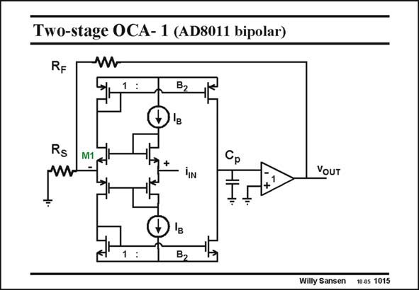

# SANSEN-1015 · Two-stage OCA- 1 (AD8011 bipolar)

章节：10 电流输入型运算放大器  
PDF 页：291；书本页：298；幻灯片编号：1015  
状态：unreviewed



## 对应教材讲解

### PDF 291 · 书本 298

A single-stage amplifier is easily extended to a twostage amplifier as shown next. This amplifier is copied from an earlier slide for sake of comparison. Note that the emitter followers at the output are represented by a voltage amplifier with unity gain.

## 公式／性能结论候选摘录

以下为规则截取的原文，尚未逐项判读。

- PDF 291: Note that the emitter followers at the output are represented by a voltage amplifier with unity gain.

## 曲线结论候选摘录

以下为规则截取的原文，尚未逐项判读。

（未由规则找到；不代表原页没有此类内容。）

## 原文条件与近似候选摘录

以下为规则截取的原文，尚未逐项判读。

（未由规则找到；不代表原页没有此类内容。）

## 幻灯片 OCR（未校正）

```text
Two-stage OCA- 1 (AD8011 bipolar)
RF
-W
B2
Rs
M1
+
In
B2
YOUT
Willy Sansen
10.05 1015
```

数学上下标、分数及正负号以原图为准。电路图已保留；未核对的连接不输出成可仿真 netlist。
