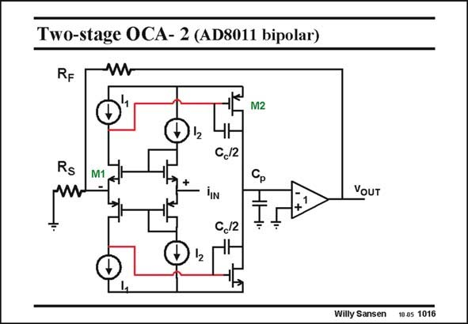

# SANSEN-1016 · Two-stage OCA- 2 (AD8011 bipolar)

章节：10 电流输入型运算放大器  
PDF 页：291；书本页：298；幻灯片编号：1016  
状态：unreviewed



## 对应教材讲解

### PDF 291 · 书本 298

The two-stage current amplifier is shown in this slide. Obviously, a compensation capacitor is now required, which will cause more current to flow in the second stage. The main advantage is however that the output swing can be larger. Also, more gain can be achieved without the use of cascodes. Again, bipolar transistors are used at the input to have a smaller input resistance. Is this why smaller values can be used for the series input resistor R , yielding higher gain-bandwidth combinations? S The input cascode transistors determine the noise performance in single-stage current amplifiers. Active loads are now used for these cascodes. Is their noise still dominant? The answer is positive. Indeed, at higher frequencies, the compensation capacitance acts as a short-circuit. The second stage is little more than an impedance 1/g . This is a low impedance. m2 The noise of the input cascodes is therefore still dominant.

## 公式／性能结论候选摘录

以下为规则截取的原文，尚未逐项判读。

- PDF 291: Also, more gain can be achieved without the use of cascodes.
- PDF 291: Is this why smaller values can be used for the series input resistor R , yielding higher gain-bandwidth combinations?
- PDF 291: This is a low impedance. m2 The noise of the input cascodes is therefore still dominant.

## 曲线结论候选摘录

以下为规则截取的原文，尚未逐项判读。

（未由规则找到；不代表原页没有此类内容。）

## 原文条件与近似候选摘录

以下为规则截取的原文，尚未逐项判读。

（未由规则找到；不代表原页没有此类内容。）

## 幻灯片 OCR（未校正）

```text
Two-stage OCA- 2 (AD8011 bipolar)
RF
-W
M2
Rs
W
M1
+
ЧН
C,12
"IN
C,12
Cр
YoUT
Willy Sansen
10.05 1016
```

数学上下标、分数及正负号以原图为准。电路图已保留；未核对的连接不输出成可仿真 netlist。
