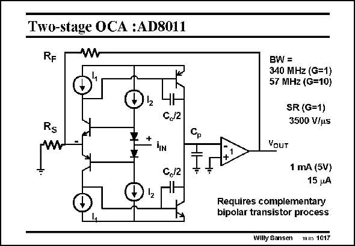

# SANSEN-1017 · Two-stage OCA :AD8011

章节：10 电流输入型运算放大器  
PDF 页：292；书本页：299；幻灯片编号：1017  
状态：unreviewed



## 对应教材讲解

### PDF 292 · 书本 299

In bipolar technology, this current opamp has excellent performance. For a gain of 10, the bandwidth is 57 MHz. For a gain of 1, the BW is 340 MHz and the SR is an impressive 3500 V/ms. The quiescent current is only 1 mA on a single 5 V supply. The input current for these values is 15 mA.

## 公式／性能结论候选摘录

以下为规则截取的原文，尚未逐项判读。

- PDF 292: For a gain of 10, the bandwidth is 57 MHz.
- PDF 292: For a gain of 1, the BW is 340 MHz and the SR is an impressive 3500 V/ms.

## 曲线结论候选摘录

以下为规则截取的原文，尚未逐项判读。

（未由规则找到；不代表原页没有此类内容。）

## 原文条件与近似候选摘录

以下为规则截取的原文，尚未逐项判读。

（未由规则找到；不代表原页没有此类内容。）

## 幻灯片 OCR（未校正）

```text
Two-stage OCA :AD8011
RF
w
12
BW=
340 MHz (G=1)
57 MHz (G=10)
SR (G=1)
3500 V/us
Rs
+
TIN
C./2
C,/2
YouT
1 mA (5V)
15 pA
Requires complementary
bipolar transistor process
Wilty Sansen Wns 1017
```

数学上下标、分数及正负号以原图为准。电路图已保留；未核对的连接不输出成可仿真 netlist。
