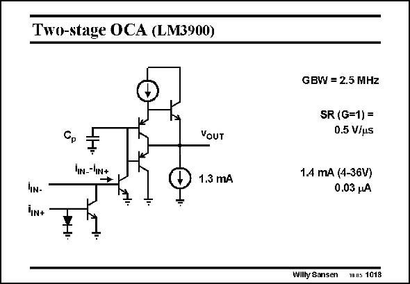

# SANSEN-1018 · Two-stage OCA (LM3900)

章节：10 电流输入型运算放大器  
PDF 页：292；书本页：299；幻灯片编号：1018  
状态：unreviewed



## 对应教材讲解

### PDF 292 · 书本 299

Current amplifiers have existed before. An earlier current amplifier is shown in this slide. The current difference at the input is realized by addition of a current mirror on the non-inverting input terminal. It is clearly a single-stage amplifier with modest performance.

## 公式／性能结论候选摘录

以下为规则截取的原文，尚未逐项判读。

（未由规则找到；不代表原页没有此类内容。）

## 曲线结论候选摘录

以下为规则截取的原文，尚未逐项判读。

（未由规则找到；不代表原页没有此类内容。）

## 原文条件与近似候选摘录

以下为规则截取的原文，尚未逐项判读。

（未由规则找到；不代表原页没有此类内容。）

## 幻灯片 OCR（未校正）

```text
Two-stage OCA (LM3900)
YOUT
IN--IN+
1.3 mА
hIN-
In+
÷
GBW = 2.5 MHz
SR (G=1) =
0.5 V/us
1.4 mA (4-36V)
0.03 HA
Willy Sansen
wns 1018
```

数学上下标、分数及正负号以原图为准。电路图已保留；未核对的连接不输出成可仿真 netlist。
