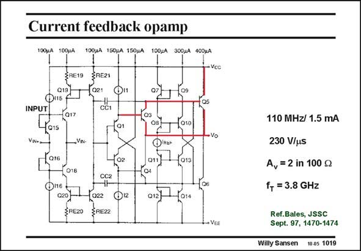

# SANSEN-1019 · Current feedback opamp

章节：10 电流输入型运算放大器  
PDF 页：293；书本页：300；幻灯片编号：1019  
状态：unreviewed



## 对应教材讲解

### PDF 293 · 书本 300

An integrated current amplifier is depicted in this slide. It is a two-stage amplifier with current input. The output of the first stage is at the Drains of transistors Q21/Q22. Transistors Q1 and Q2 now serve as emitter followers to drive the second stage. In this stage, pnp-npn composites are used to drive the output load. For example, the Q3/Q5 composite behaves as a super-pnp transistor. On the other side, Q4/Q6 are a super npn. The compensation capacitances CC1 and CC2 are connected from the middle point of such a composite, which is a strange point indeed. The performance is great: 110 MHz bandwidth and 230 V/ms, using bipolar transistors with an f of 3.8 GHz only! T

## 公式／性能结论候选摘录

以下为规则截取的原文，尚未逐项判读。

- PDF 293: The performance is great: 110 MHz bandwidth and 230 V/ms, using bipolar transistors with an f of 3.8 GHz only!

## 曲线结论候选摘录

以下为规则截取的原文，尚未逐项判读。

（未由规则找到；不代表原页没有此类内容。）

## 原文条件与近似候选摘录

以下为规则截取的原文，尚未逐项判读。

（未由规则找到；不代表原页没有此类内容。）

## 幻灯片 OCR（未校正）

```text
Current feedback opamp
100,A
100UA
100JA 150pA 150uA 100÷A 300JA 400шA
ZRE19
Q19}
Ф115
INPUT
Q17
SRE21
-021
cơt
@i1
015
VIN+
-VN-
-016
02
018
CC2
020)
ZRE2O
022
SREZZ
021
Q3
-о1о
OiRE-
011}
013
C4
012|
-(014
- Vcc
+ VEE
110 MHz/ 1.5 mA
230 V/us
A, = 2 in 100 g
f+ = 3.8 GHz
Ref.Bales, JSSC
Sept. 97, 1470-1474
Willy Sansen 1005 1019
```

数学上下标、分数及正负号以原图为准。电路图已保留；未核对的连接不输出成可仿真 netlist。
