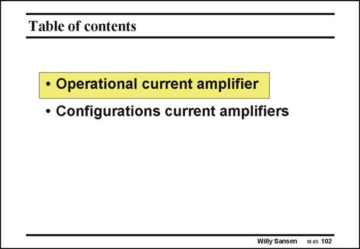

# SANSEN-102 · Table of contents

章节：10 电流输入型运算放大器  
PDF 页：284；书本页：291；幻灯片编号：102  
状态：unreviewed



## 对应教材讲解

### PDF 284 · 书本 291

First of all, full operational amplifiers are discussed, after which some more configurations are following. In this class, transresistance amplifiers can be added as well. They are discussed in Chapter 14 however, on shunt-series feedback at the input. As a result this is a fairly short Chapter.

## 公式／性能结论候选摘录

以下为规则截取的原文，尚未逐项判读。

- PDF 284: As a result this is a fairly short Chapter.

## 曲线结论候选摘录

以下为规则截取的原文，尚未逐项判读。

（未由规则找到；不代表原页没有此类内容。）

## 原文条件与近似候选摘录

以下为规则截取的原文，尚未逐项判读。

（未由规则找到；不代表原页没有此类内容。）

## 幻灯片 OCR（未校正）

```text
Table of contents
• Operational current amplifier
• Configurations current amplifiers
Willy Sansen
10.05 102
```

数学上下标、分数及正负号以原图为准。电路图已保留；未核对的连接不输出成可仿真 netlist。
